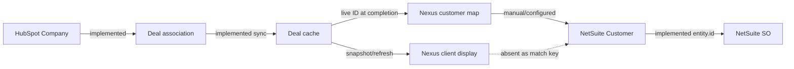
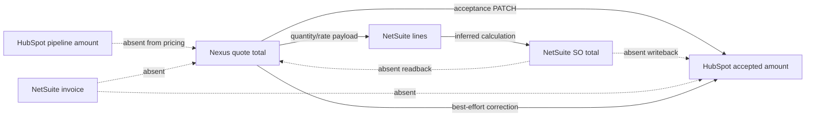
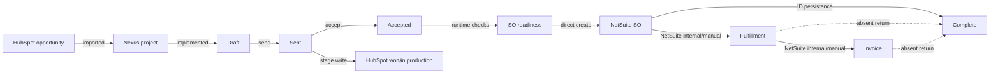

# ADR-001A Evidence Dossier — Field Ownership & Synchronization Matrix

Audit date: 2026-07-29  
Mode: Repository investigation, read-only except for this explicitly authorized report  
Systems: HubSpot, Nexus, NetSuite  
External systems contacted: None

## 1. Executive Summary

| Classification | Finding |
|---|---|
| **Code Proven** | Nexus reads HubSpot Deals, companies, owners, pipeline stages, Products, and selected custom properties. |
| **Code Proven** | Deal synchronization is mixed: full cache synchronization, single-Deal synchronization, manual project refresh, and request-triggered background refresh. |
| **Code Proven** | Project import copies selected Deal fields once. Deal name, client name, stage, and owner linkage can later be overwritten by manual refresh. |
| **Code Proven** | HubSpot Deal `amount` is cached but does not feed Nexus pricing. Nexus calculates quote revenue independently. |
| **Code Proven** | Nexus writes the configured stage and selected-tier calculated amount to HubSpot during Mark Accepted. |
| **Code Proven** | Nexus directly creates NetSuite Sales Orders; it does not route accepted quotes through a HubSpot Quote object. |
| **Code Proven** | NetSuite returns an internal SO ID and, through a follow-up GET, a display `tranId`; Nexus persists both. |
| **Code Proven** | NetSuite SO total, current status, fulfillment, invoice, payment, and AR balance do not return to Nexus or HubSpot. |
| **Code Proven** | Quote data freezes at send, acceptance, and completion. |
| **Code Proven** | The complete NetSuite payload is not frozen before submission. It combines send-time snapshots with live completion-time cache, mapping, costing, and configuration values. |
| **Code Proven** | Single-Deal synchronization can leave later HubSpot extension fields stale because its conflict-update clause omits them. |
| **Code Proven** | HubSpot Product↔Nexus leaf synchronization exists separately from Deal and Quote synchronization. |
| **Documentation Claim** | `docs/SPEC.md` says acceptance creates a HubSpot Quote with structured line items and composite COGS. No implementation was found. |
| **Documentation Claim** | Canonical documentation says the existing HubSpot→NetSuite SO integration remains in place. Current code bypasses it. |
| **Inferred** | HubSpot owns CRM opportunity identity/reporting, Nexus owns quote construction, and NetSuite owns financial operations after SO creation. |
| **Inferred** | HubSpot custom Deal fields used for SO headers are treated as live inputs until completion, but no explicit business freeze policy establishes that behavior. |
| **Unknown** | Production currency, property, pipeline, customer, tax, subsidiary, and item configurations were not verified. |
| **Unknown** | Business approval of the absence of NetSuite lifecycle reconciliation and amendment handling is not evidenced. |

Largest unresolved risks are stale Deal-cache extension values, customer reassociation before SO creation, undefined currency, absent NetSuite total/status return, no amendment model, conflicting category meanings, missing PM propagation, nondurable HubSpot amount repair, the manual NetSuite wrapping step, and unimplemented HubSpot Quote/COGS commitments.

## 2. Integration Repository Map

### HubSpot

| Area | File | Role |
|---|---|---|
| API client | `src/lib/hubspot.ts` | Separate read/write clients; Deal, pipeline, company, owner, Product, stage, and amount operations. |
| Errors | `src/lib/hubspot-error.ts` | HubSpot-specific error wrapper. |
| Link validation | `src/lib/hubspot-linkage.ts` | Distinguishes real HubSpot Deal IDs from fixtures/placeholders. |
| Stage display | `src/lib/hubspot-stage-label.ts` | Converts stage identifiers to display labels. |
| Property configuration | `src/lib/hubspot-cache.ts:24-59` | Defines core and extended Deal properties requested during synchronization. |
| Cache schema | `src/db/schema.ts:1173-1219` | Defines `hubspot_deals_cache`. |
| Full sync | `src/lib/hubspot-cache.ts:174-274` | Fetches active Deals and transactionally replaces active-stage cache rows. |
| Single sync | `src/lib/hubspot-cache.ts:276-339` | Reads/upserts one Deal; conflict update omits extension fields. |
| Cache reads | `src/lib/hubspot-cache.ts:62-112` | Staleness, pagination, search, and count. |
| Import route | `src/app/import/page.tsx`, `deal-list.tsx` | Empty-cache sync, stale refresh, listing, search, pagination, and import. |
| Manual refresh | `src/app/import/actions.ts`, `refresh-header.tsx` | Runs full synchronization and displays/polls status. |
| Status API | `src/app/api/import/cache-status/route.ts` | Returns cache status. |
| Project import | `src/app/actions/projects.ts:62-112` | Fresh sync, duplicate check, project insert, audit, redirect. |
| Project refresh | `src/app/actions/projects.ts:114-199` | Overwrites selected project snapshots. |
| Acceptance writeback | `src/app/actions/quotes.ts:1978-2444` | Writes stage and accepted-tier amount. |
| Deal PATCH | `src/lib/hubspot.ts:194-254` | Sends stage and amount in one PATCH. |
| Amount repair | `src/lib/netsuite/mark-complete.ts:807-872` | Best-effort completion-time amount correction. |
| Rollback | `src/app/actions/quotes.ts:2447-2602` | Restores captured prior stage. |
| Product mapping | `src/lib/hubspot-mapper.ts:1-117` | HubSpot Product↔Nexus leaf mapping. |
| Product pull/create | `src/lib/hubspot-pull.ts`, `src/app/actions/hubspot-pull.ts`, `src/app/actions/leaves.ts` | Batched Product import and optional Product creation. |
| Documentation | `docs/HUBSPOT_CACHE.md`, `docs/cc-slice-12-doc-reconciliation-report.md` | Intended cache model and documented shipped-vs-canonical gaps. |

### Nexus

| Area | File | Role |
|---|---|---|
| Project schema/status | `src/db/schema.ts:264-303` | Deal linkage, client/owner/PM snapshots, category, active/archive, provenance. |
| Quote/scenario schema | `src/db/schema.ts:305-540` | Lifecycle, acceptance, revision, snapshots, and NetSuite mirrors. |
| Tiers | `src/db/schema.ts:543-579` | Quantity, order, recommendation, and price adjustments. |
| Send snapshots | `src/db/schema.ts:616-672` | Per-send commercial/PDF/acceptance history. |
| BOM/components | Assembly and leaf blocks in `src/db/schema.ts`; `src/app/actions/assemblies.ts` | Assembly, leaf library, membership, and draft mutations. |
| Costs | `src/lib/costing.ts`, `costing-adapter.ts`, `costing-store.ts`, `src/app/actions/costing.ts` | Cost persistence, adaptation, and calculation. |
| Pricing/margins | `src/lib/pricing-classifier.ts`, `pricing-predicates.ts`, `pricing-suggestions.ts`, pricing actions | Pricing policy, classification, suggestions, and mutations. |
| Firm policy | `src/db/schema.ts:765-862` | Margin thresholds, commercial defaults, HubSpot stage, NetSuite defaults. |
| Quote lifecycle | `src/app/actions/quotes.ts` | Create, send, revise, accept, rollback, and completion wrapper. |
| Locks | `src/lib/action-result.ts`, `src/lib/quote-guards.ts`, `docs/pattern-52-freeze-list.md` | Server-side freeze guards and canonical inventory. |
| SO readiness | `src/lib/netsuite/sales-order-preflight.ts` | Customer/cache/push-state preflight. |
| SO UI | `src/components/quote-umbrella/tab-sales-order.tsx`, `order-receipt.tsx` | Pending, failed, and record surfaces. |
| Audit | `auditLog` in `src/db/schema.ts` and domain actions | Business-transition evidence. |

### NetSuite

| Area | File | Role |
|---|---|---|
| Client/config | `src/lib/netsuite/client.ts` | Configuration and SuiteTalk/SuiteQL requests. |
| Authentication | `src/lib/netsuite/oauth.ts` | Token-based authentication. |
| Errors | `src/lib/netsuite/errors.ts` | Response/network classification. |
| Customer lookup | `src/lib/netsuite/customer-map.ts`; `src/db/schema.ts:2343-2390` | HubSpot company→NetSuite customer mapping. No customer creation found. |
| Item lookup | `src/lib/netsuite/item-resolver.ts`, types/format helpers | Nexus SKU→NetSuite item resolution. |
| Item Groups | `src/lib/netsuite/item-groups.ts`; `src/db/schema.ts:2282-2341` | Retained find/create support, deliberately unused by SO path. |
| Field normalization | `project-source-resolver.ts`, `business-segment-resolver.ts` | HubSpot labels/IDs→NetSuite list/class values. |
| Payload | `src/lib/netsuite/sales-orders.ts:34-177` | SO header and flat leaf-line payload. |
| Idempotency/create | `src/lib/netsuite/sales-orders.ts:179-223` | Deterministic key and create wrapper. |
| `tranId` read | `src/lib/netsuite/sales-orders.ts:226-263` | Follow-up GET. |
| Orchestration | `src/lib/netsuite/mark-complete.ts:101-872` | Guards, mappings, payload, create, retry, persistence, freeze, HubSpot repair. |
| Push history | `src/db/schema.ts:2392-2437` | Attempts, payload, errors, IDs, amount, unique-success rule. |
| Status/invoice reads | None found | No current SO status, total, fulfillment, invoice, payment, or AR reads. |
| Reconciliation | Completion retry only | Prior-success convergence and missing-`tranId` backfill. |

### Cross-System

| Area | Evidence | Behavior |
|---|---|---|
| Shared types | `src/types/quote.ts` and integration-local interfaces | No single canonical three-system contract. |
| Mapping | HubSpot mapper; NetSuite customer/item/list resolvers | Boundary-specific explicit mappings. |
| Normalization | Cache mapper, Product mapper, SO builder | Local date/number/ID normalization. |
| Background jobs | `/import` stale refresh through framework `after()` | Request-triggered and nondurable. |
| Webhooks | None found | Absent for reviewed flows. |
| Scheduled sync | None found | Absent. |
| Logs | `audit_log`, `netsuite_so_pushes`, console logs | Lifecycle/push evidence; limited cache/external-drift visibility. |
| Tests | Adapter, smoke, verification, cleanup scripts, manual QA docs | No complete automated three-system suite. |

## 3. Complete Field Inventory

### HubSpot Deal, Cache, and Project

| Column | Required meaning | Business concept | Human-readable meaning | Source field | Source system | Destination field | Destination system | Direction | Trigger | Current behavior | Editable in Nexus? | Current source of truth | Freeze event | Audit behavior | Failure behavior | Evidence | Confidence |
|---|---|---|---|---|---|---|---|---|---|---|---|---|---|---|---|---|---|
| `deal_id`; `projects.hubspot_deal_id` | Stable CRM link | Opportunity identity | Deal represented by project | Deal object ID | HubSpot | Cache/project Deal ID | Nexus | One-way | Sync/import | Cached and copied; project unique | No | HubSpot identity | Import | `created` includes Deal ID | Concurrent import may raise unique error | `schema.ts:266-274,1173+`; `projects.ts:62-112` | Proven |
| `deal_name` | Opportunity title | Naming | Deal/project name | `dealname` | HubSpot | Cache/project `deal_name` | Nexus | One-way | Sync/import/refresh | Import snapshot; manual refresh overwrites | No | HubSpot | None | Refresh diff | Old value retained on failure | `hubspot-cache.ts:24-160`; `projects.ts:114-199` | Proven |
| `deal_stage` | CRM state | Lifecycle | Pipeline stage | `dealstage` | HubSpot | Cache/project stage | Nexus | Inbound plus separate outbound write | Sync/import/refresh | Refreshable snapshot, independent of quote status | No | HubSpot | None | Refresh/acceptance audit | Partial external/DB state possible | `hubspot.ts:161-254`; project actions | Proven |
| Cache `amount` | CRM estimate/report | Revenue | HubSpot Deal amount | `amount` | HubSpot | Cache `amount` | Nexus | One-way cache | Sync | Not used by pricing | No | HubSpot reporting | None | None | Can be stale | `hubspot-cache.ts:32-33,143-144` | Proven |
| HubSpot `amount` write | Accepted revenue report | Revenue | Nexus selected-tier total | `tierRollup.totalRevenue` | Nexus | Deal `amount` | HubSpot | One-way upstream | Accept/complete repair | Overwrites CRM amount, rounded 2dp | Derived | Nexus at write moment | Acceptance | Pushed amount audited | Accept blocks; repair failure nonblocking | `hubspot.ts:194-254`; quote/complete actions | Proven |
| `close_date` | CRM timing | Opportunity timing | Deal close date | `closedate` | HubSpot | Cache | Nexus | One-way | Sync | Cache-only | No | HubSpot | None | None | Stale on failure | `hubspot-cache.ts` | Proven |
| Owner ID/name/email; `projects.sales_rep_user_id` | Sales ownership | Attribution | CRM owner and matching Nexus user | Owner APIs | HubSpot | Cache/project owner fields | Nexus | One-way-derived | Sync/import/refresh | Exact email resolves Nexus user; refresh may overwrite | No | HubSpot for owner; Nexus for FK | Prepared-by freezes at send | Refresh audit | Missing match leaves null | `hubspot.ts:308-378`; `projects.ts:25-199` | Proven |
| Company ID/name; `projects.client_name` | Customer identity/display | Customer | Associated HubSpot company | Deal-company association | HubSpot | Cache; project client snapshot | Nexus | One-way | Sync/import/refresh | Name copied/refreshed; current company ID drives NS mapping | No | HubSpot | No legal-entity freeze | Refresh/payload evidence | Missing company blocks SO | `hubspot-cache.ts`; `mark-complete.ts:203-231` | Proven |
| PM ID/name/email; `projects.pm_user_id` | Project manager | Ownership | PM responsible for project | Optional Deal property | HubSpot | Cache PM fields; project PM remains null | Nexus | Cache-only | Sync/import | Cached but not propagated | No import mapping | Ambiguous | None | None | Silent non-propagation | Cache/project actions | Proven |
| HubSpot created/updated timestamps | CRM history | Provenance | Deal creation/modification time | `createdate`, `hs_lastmodifieddate` | HubSpot | Cache timestamps | Nexus | One-way | Sync | Listing/cache metadata | No | HubSpot | None | None | Stale on failure | `hubspot-cache.ts` | Proven |
| Cache/project sync timestamps | Integration freshness | Provenance | Last cache/project refresh | Nexus clock | Nexus | `last_synced_at`, `last_hubspot_refresh_at` | Nexus | Local | Sync/refresh | Drives stale UI/evidence | No | Nexus | None | Project refresh audited | Prior time remains on failure | Cache/project actions | Proven |
| `deal_folder_url` | Accounting link | Documents | SharePoint/accounting URL | HubSpot property | HubSpot | Cache; two NS link fields | Nexus/NetSuite | One-way | Sync/SO create | Live cache at completion | No | HubSpot | None | Payload snapshot | Single-sync can leave stale | `sales-orders.ts:121-124`; `mark-complete.ts:203-220` | Proven |
| `project_service_s` | Service category | Order classification | Project service | HubSpot property | HubSpot | NS custom field | NetSuite | One-way | SO create | Conditional live cache value | No | HubSpot | None | Payload snapshot | Empty omitted/stale possible | `sales-orders.ts:125-126` | Proven |
| HubSpot project category | CRM/order category | Classification | Category sent to NetSuite | HubSpot property | HubSpot | NS custom field | NetSuite | One-way | SO create | Distinct from Nexus category | No | HubSpot for payload | None | Payload snapshot | No conflict warning | `sales-orders.ts:127-128` | Proven |
| `projects.project_category` | Local category | Workflow classification | Nexus project category | Default/PM edit | Nexus | Project UI | Nexus | Local | Import/edit | Defaults `packaging`; not sent to NS | Yes | Nexus | None | Category audit | No external reconciliation | Project schema/actions | Proven |
| `sourcing_location` | Project source | Order classification | HubSpot source label | HubSpot property | HubSpot | Resolved NS list ID | NetSuite | One-way | SO create | Label→internal ID | No | HubSpot/NS taxonomy | None | Payload snapshot | Resolver failure blocks | Project-source resolver | Proven |
| Business segment ID/label | Business classification | Accounting/reporting | Segment/class | HubSpot property/resolver | Mixed | NS `class`, custom segment | NetSuite | One-way | SO create | ID sent to both NS fields | No | Ambiguous bridge | None | Payload snapshot | Invalid mapping can block/reject | Business-segment resolver; payload | Proven |
| `client_po` | Customer PO | Commercial reference | Purchase-order number | HubSpot property | HubSpot | NS custom field | NetSuite | One-way | SO create | Live cache, conditional | No | Unresolved | None | Payload snapshot | Empty omitted/stale possible | `sales-orders.ts:131` | Proven |
| Invoice/production dates | Billing/shipping schedule | Operational timing | Estimated invoice and ship dates | HubSpot properties | HubSpot | NS custom fields and `shipDate` | NetSuite | One-way | SO create | Live cache; production date mirrored | No | Unresolved | None | Payload snapshot | Empty/stale possible | `sales-orders.ts:132-137` | Proven |
| Priority/Deal type | CRM classifications | Operations/reporting | Priority and type | HubSpot properties | HubSpot | NS custom fields | NetSuite | One-way | SO create | Conditional | No | HubSpot | None | Payload snapshot | Empty omitted | `sales-orders.ts:138-139` | Proven |
| `projects.status` | Workspace state | Local lifecycle | Active or archived | Nexus action/default | Nexus | Project | Nexus | Local | Import/archive | Independent of HubSpot close/delete | Conditional | Nexus | Archive | Archive audit | No automatic reconciliation | Project schema/actions | Proven |
| Import/create/update timestamps and actor | Local provenance | Audit/history | Who/when project was created/changed | Nexus/DB clock | Nexus | Project fields | Nexus | Local | Import/actions | Persisted locally | No direct edit | Nexus | Import | Creation/action audit | Project may persist if separate audit fails | Project schema/actions | Proven |

### HubSpot Products and Nexus Leaves

| Column | Required meaning | Business concept | Human-readable meaning | Source field | Source system | Destination field | Destination system | Direction | Trigger | Current behavior | Editable in Nexus? | Current source of truth | Freeze event | Audit behavior | Failure behavior | Evidence | Confidence |
|---|---|---|---|---|---|---|---|---|---|---|---|---|---|---|---|---|---|
| `hubspot_product_id` | Product link | Identity | HubSpot Product attached to leaf | Product ID | HubSpot | Leaf external ID | Nexus | One-way return/link | Pull/create | Persisted, partial-unique | No direct ID edit | HubSpot identity | Stable link | Pull/create audit | Duplicate constraint | Mapper/schema | Proven |
| Name/SKU/unit cost/URL | Shared Product data | Product master | Product name, SKU, baseline cost, link | `name`, `hs_sku`, `hs_cost_of_goods_sold`, `hs_url` | Mixed | Matching leaf/Product fields | Mixed | Two-way subset | Pull/create | Pull overwrites leaf; create pushes Nexus value | Conditional | Ambiguous | Quote structure locks at send | Product audits | No merge warning | `hubspot-mapper.ts:11-29,81-116` | Proven |
| Image | Product media | Product master | First image URL | `hs_images` | HubSpot | Leaf image | Nexus | One-way | Pull | First URL only | Conditional | HubSpot | None | Pull audit | Additional images discarded | `hubspot-mapper.ts:55-58` | Proven |
| Owner/FSC fields | Responsibility/compliance | Product metadata | Owner and certification data | HubSpot owner/FSC properties | HubSpot | Leaf fields | Nexus | One-way | Pull | Normalized; unmatched/unknown becomes null | Conditional | HubSpot | None | Pull audit | Information may be lossy | Mapper | Proven |
| Archived | Product lifecycle | Availability | Product unavailable/archived | HubSpot archive flag | HubSpot | Leaf archived | Nexus | One-way | Pull | Pull wins | No merge | HubSpot | Pull | Archive transition audit; unarchive gap | Parallel pull can race | `hubspot-pull.ts:164-217` | Proven |
| Description/Product price | Unmapped Product data | Product master | Description/catalog price | HubSpot fields | HubSpot | None | None | No synchronization | None | Explicitly skipped | N/A | HubSpot | None | None | Absent | `hubspot-mapper.ts:18-20` | Proven |

### Quote, Lifecycle, Pricing, and NetSuite Boundary

| Column/value | Required meaning | Business concept | Human-readable meaning | Source field | Source system | Destination field | Destination system | Direction | Trigger | Current behavior | Editable in Nexus? | Current source of truth | Freeze event | Audit behavior | Failure behavior | Evidence | Confidence |
|---|---|---|---|---|---|---|---|---|---|---|---|---|---|---|---|---|---|
| Quote/project/scenario/version IDs | Local identity | Quote construction | Internal quote lineage | Generated/local FKs | Nexus | Related Nexus tables | Nexus | Local | Create/revise | Unique/project-linked | No direct edit | Nexus | Creation/send history | Quote/scenario audits | Primary creation/version races possible | `schema.ts:305-540`; quote actions | Proven |
| `quotes.status`, scenario status | Lifecycle | Quote state | Draft/sent/accepted/complete and scenario state | Nexus actions | Nexus | Guards/UI | Nexus | Local | Lifecycle actions | Drives editability | Only transitions | Nexus | Send/accept/complete | Lifecycle audits | Wrong-state actions reject | Schema/actions | Proven |
| Quote number, sent/valid dates | Formal quote | Customer artifact | Formal reference and validity | Nexus sequence/settings | Nexus | Quote/snapshot/PDF | Nexus | Local | Send | Assigned/frozen | No afterward | Nexus | Send | Send audit | Config/constraint failure blocks | `schema.ts:415-427,528-534`; send action | Proven |
| T&Cs, terms, lead time, incoterms, days valid | Commercial contract | Terms | Values customer received | Current firm settings | Nexus | Quote/snapshot; payment terms to NS | Nexus/NetSuite | Snapshot then one-way | Send/SO create | Frozen at send | No afterward | Nexus snapshot | Send | Send/payload evidence | Empty NS terms omitted | `schema.ts:420-437,616-672`; payload | Proven |
| Prepared-by fields | Sender identity | Customer contact | Quote preparer contact | Nexus user, HS owner, caller fallback | Mixed | Quote/snapshot/PDF | Nexus | One-way-derived | Send | Resolution order then freeze | No afterward | Nexus snapshot | Send | Send audit | Fallback avoids owner block | `quotes.ts:1411+` | Proven |
| PDF axes/URL | Artifact state | Customer document | Layout and stored PDF | Nexus UI/storage | Nexus | Quote/snapshot | Nexus | Local | Send | Frozen | No afterward | Nexus | Send | PDF/send audit | Generation/storage failure | Schema/send action | Proven |
| Customer acceptance fields | Customer choice | Acceptance | When, which tier, who recorded | PM input/current user | Nexus | Quote | Nexus | Local | Record/Mark Accepted | Stored on sent/accepted quote | Conditional before freeze | Nexus | Acceptance | Acceptance audits | Wrong state/missing tier blocks | `schema.ts:400-414`; acceptance actions | Proven |
| `accepted_tier_id` | Final commitment | Sales Order choice | Tier shipped to NetSuite | Override or customer tier | Nexus | Quote/push scope | Nexus/NetSuite | One-way selection | Complete | Written in freeze transaction | No afterward | Nexus | Complete | Before/after audited | Missing/invalid blocks | `mark-complete.ts:116-149,681-758` | Proven |
| HubSpot pending stage fields | Retry/rollback safety | External lifecycle | Original CRM stage/version | HubSpot read + quote version | Mixed | Quote transient fields | Nexus | Temporary inbound/local | Mark Accepted | Preserved across retry, cleared on success | No | Nexus retry state | Acceptance | Final audit records stage | Partial failure leaves pending | `schema.ts:465-501` | Proven |
| `hubspot_quote_id` | CRM Quote identity | HubSpot Quote | Intended external Quote ID | None | None | Quote column | Nexus | No synchronization | None | Never populated | No | Undefined | None | None | Feature absent | `schema.ts:344`; reconciliation report | Proven |
| BOM assembly/leaf/SKU | Product structure | BOM | Components being sold | Nexus assembly/leaf tables | Nexus | Costing and flat NS lines | NetSuite | One-way-derived | SO create | Assemblies flatten to leaf lines | Draft only | Nexus | Send | Payload/push audit | Missing assemblies/items block | `mark-complete.ts:237-263,420-465` | Proven |
| Tier qty and `qtyPerParent` | Order quantity | Commercial/BOM quantity | Units ordered | Nexus tier/BOM | Nexus | NS line quantity | NetSuite | One-way-derived | SO create | `tier.qty × max(1, round(qtyPerParent))` | Draft only | Nexus | Send | Payload snapshot | Bad values create wrong quantity | `mark-complete.ts:448-465` | Proven |
| Price adjustments | Pricing | Sell-price control | Global/tier adjustment | Quote/tier fields | Nexus | Costing | Nexus | Local-derived | Draft pricing | Feeds required sell | Draft only | Nexus | Send | Pricing audit | Frozen action rejects | `schema.ts:345-353,553-558` | Proven |
| Cost inputs | COGS | Cost construction | Packaging/freight/duty/production/inventory/service costs | Nexus cost tables | Nexus | Costing rollups | Nexus | Local-derived | Draft entry | No HubSpot amount input | Draft only | Nexus | Send | Cost action audit varies | Frozen action rejects | Costing schema/actions | Proven |
| Required sell/unit | Unit price | Revenue | Per-component sell price | Nexus costing | Nexus | NS `rate` | NetSuite | One-way-derived | SO create | Rounded 4dp | Derived | Nexus before create | Complete payload | Payload snapshot | NS may round differently | `mark-complete.ts:420-465`; payload | Proven |
| Contribution cost/unit | Unit COGS | Cost reporting | Per-component contribution cost | Nexus costing | Nexus | `custcol_dps_unit_cost` | NetSuite | One-way-derived | SO create | Rounded 4dp, optional | Derived | Nexus | Complete payload | Payload snapshot | Null omitted | Same | Proven |
| Total revenue | Quote/order revenue | Revenue | Selected tier total | Nexus costing | Nexus | HubSpot amount, push amount, NS lines | Mixed | One-way-derived | Accept/complete | Rounded 2dp at external boundaries | Derived | Nexus before SO | Accept/complete | Acceptance/completion audit | HS repair can fail; NS total not compared | `mark-complete.ts:151-186` | Proven |
| Margin dollars/percent/status | Profit/risk | Margin | Quote profitability and policy result | Nexus costing + firm settings | Nexus | UI/gates | Nexus | Local-derived | Pricing/accept/complete | BELOW_FLOOR blocks completion | No direct edit | Nexus | Inputs freeze at send | Transition/pricing evidence | Blocks where required | Costing/classifier/complete guard | Proven |
| Currency | Monetary denomination | Finance | Quote/SO currency | None explicit | Unknown | None explicit | Unknown | No synchronization | None | USD formatting implies assumption | No | Unknown | None | None | Mismatch undetected | Schema/payload search | Unknown |
| Tax | Taxation | Finance | Tax NetSuite applies | Optional firm override/NS engine | Mixed | NS line tax code/derived tax | NetSuite | Conditional one-way/NS-derived | SO create | Omitted by default | Admin config | NetSuite | Payload time | Payload snapshot | Bad override can reject/mis-tax | `sales-orders.ts:48-53,155-172` | Proven |

### NetSuite Customer, SO, Status, and Finance

| Column/property | Required meaning | Business concept | Human-readable meaning | Source field | Source system | Destination field | Destination system | Direction | Trigger | Current behavior | Editable in Nexus? | Current source of truth | Freeze event | Audit behavior | Failure behavior | Evidence | Confidence |
|---|---|---|---|---|---|---|---|---|---|---|---|---|---|---|---|---|---|
| Customer map IDs | Cross-system customer identity | Legal customer | HS company mapped to NS customer | HS company ID/admin NS ID | Mixed | Mapping table, `entity.id` | Nexus/NetSuite | One-way reference | Preflight/SO create | Exact ID mapping; names advisory | Admin only | NetSuite identity/Nexus map | Payload time | Mapping/payload evidence | Missing map blocks | `customer-map.ts`; map schema | Proven |
| Subsidiary/status/tax defaults | Financial configuration | Accounting/order state | Initial NS configuration | Current firm settings | Nexus | NS header/lines | NetSuite | One-way | SO create | Read live at completion | Admin | NetSuite/config | Payload time | Payload snapshot | Invalid/missing values block/reject | Firm schema/payload | Proven |
| Memo/Deal ID/links/classifications/PO/dates | SO header | Traceability/operations | CRM metadata copied to order | Project/cache fields | Mixed | NS body fields | NetSuite | One-way | SO create | Conditional live values | No | Mixed | No pre-SO freeze | Payload snapshot | Stale/invalid values possible | `sales-orders.ts:92-145` | Proven |
| NS project manager | Order ownership | Operations | Manager on SO | `projectManagerNsId` input | Unknown | NS field | NetSuite | No effective sync | SO create | Builder supports, caller omits | No | Unknown | None | Payload proves omission | Silently omitted | `sales-orders.ts:77,140-141`; complete payload call | Proven |
| Ship-to | Fulfillment identity | Shipping | Delivery address | NS customer default | NetSuite | SO shipping address | NetSuite | Internal NS derivation | SO create | Nexus omits address | No | NetSuite | Create | No Nexus address audit | Wrong default undetected | `sales-order-preflight.ts:53-58,134-146` | Proven |
| Requested ship date | Customer schedule | Shipping | Requested date | No field | None | Receipt | Nexus | No sync | None | Renders TBC | No | Unknown | None | None | Feature absent | `order-receipt.tsx:108-111` | Proven |
| NS item ID/SKU/description | Order line identity | Items | Component placed on SO | SKU resolver/Nexus leaf | Mixed | NS line fields | NetSuite | One-way | SO create | Unique SKU resolution required | No after send | NetSuite item identity | Payload time | Payload snapshot | Missing/ambiguous blocks | Item resolver/complete | Proven |
| NS quantity/rate/unit cost | Order line values | Quantity/revenue/COGS | Units, sell price, cost breadcrumb | Nexus BOM/costing | Nexus | NS line fields | NetSuite | One-way | SO create | Flat leaf lines | No after send | Nexus before create; NS after | Complete payload | Payload snapshot | Rounding/data errors affect order | Payload/complete | Proven |
| Push ID/status/key/payload/error/timestamps | Integration evidence | Reliability/audit | Attempt and exact request/result | Nexus orchestrator | Nexus | `netsuite_so_pushes` | Nexus | Local | SO attempt | Pending/failed/succeeded history | No | Nexus | Attempt/complete | Push record | Pending insert/secondary update may fail | `schema.ts:2392-2437`; complete | Proven |
| SO internal ID/`tranId` | Financial identity | Order | NetSuite order identifiers | POST response/GET | NetSuite | Push row and quote mirrors | Nexus | One-way downstream | Create/retry | Internal ID required; `tranId` best-effort | No | NetSuite | Complete | Completion audit | Retry convergence/backfill | `sales-orders.ts:226-263`; complete | Proven |
| Actual SO total | Financial truth | Revenue | NetSuite-calculated total | NetSuite SO | NetSuite | None | None | No sync | None | Not read | No | NetSuite | None | No Nexus audit | Divergence invisible | No read path | Proven absent |
| Current SO status | Operations | Lifecycle | Fulfillment/order state | NetSuite SO | NetSuite | None | None | No sync | None | UI shows configured creation state only | No | NetSuite | None | No Nexus audit | Change invisible | No read path | Proven absent |
| Fulfillment | Operations | Shipping | Fulfillment state/record | NetSuite | NetSuite | None | None | No sync | None | Absent | No | NetSuite | None | None | Invisible | No code found | Proven absent |
| Invoice ID/number/amount | Accounting | Invoice | Financial invoice and total | NetSuite | NetSuite | None | None | No sync | None | Absent | No | NetSuite | None | None | Invisible | No code found | Proven absent |
| Paid/outstanding amount | AR | Cash/account balance | Paid and balance due | NetSuite | NetSuite | None | None | No sync | None | Absent | No | NetSuite | None | None | Invisible | No code found | Proven absent |
| Currency | Financial denomination | Finance | SO/invoice currency | Unknown NS default | NetSuite | None | Nexus/HubSpot | No sync | None | Not captured/read | No | Unknown/NetSuite | None | None | Divergence undetected | No code found | Unknown |

## 4. Synchronization Policy Classification

| Field/group | Current implementation |
|---|---|
| Deal ID | Snapshot at import |
| Deal/client name and stage | Snapshot at import, manually refreshable |
| Core Deal cache | Live reference to latest sync |
| Extended Deal cache | Ambiguous or conflicting behavior |
| Inbound Deal amount | Live cache reference; no pricing sync |
| Stage/amount writeback | Derived value sent upstream |
| Company ID for NS | Live reference at completion |
| Sales-rep FK | Nexus-owned after initialization, refreshably rederived |
| Prepared-by | Synced until lock at send |
| PM | No synchronization implemented |
| Nexus category | Nexus-owned after initialization |
| HubSpot category→NS | Live reference at completion |
| Commercial defaults | Synced until lock at send |
| BOM/cost/pricing | Nexus-owned after initialization |
| Customer tier | Snapshot at acceptance |
| Committed tier | Nexus-owned commitment at completion |
| Product fields | Ambiguous or conflicting behavior |
| NS customer/items | Live reference at completion |
| SO payload | Snapshot at submission only |
| SO IDs | NetSuite-owned identifiers returned downstream |
| Actual SO status/total | No synchronization implemented |
| Fulfillment/invoice/payment | No synchronization implemented |

## 5. Freeze and Lock Analysis

| Event | Code path | Fields/behavior | Enforcement | Audit | Reversible? |
|---|---|---|---|---|---|
| Import | `importDeal()` | Copies project context | Server + Deal unique constraint | `created`, separate from insert | Deal link not UI-editable |
| First quote | `createQuote()` | Draft quote/Tier 1 | Server; multi-write not fully transactional | Attempted | Draft editable |
| Draft edits | `assertDraft`/`requireDraft` | BOM/cost/tier/pricing/notes | Server plus UI | Action-specific | Revise reopens draft |
| Send | `sendQuote()` | Status, number, terms, prepared-by, PDF snapshot | Server guard + DB transaction | `quote_sent` | Revision |
| Pricing approval | Classifier/actions | Runtime only; no formal persisted approval | UI/server predicates | Events vary | N/A |
| Customer response | `recordCustomerAcceptance()` | Time/tier/actor | Server status check + transaction | Yes | Clear action |
| Accept | `markAccepted()` | Acceptance, selected tier, snapshot, HS stage/amount | External-first + DB transaction | `quote_accepted` | Unmark/revise |
| SO readiness | Preflight + `runMarkComplete()` | Recomputed customer/item/cost/margin/cache checks | UI + server; no durable state | No single readiness audit | Recomputed |
| SO create | Completion steps 6–8 | Payload and external order | Idempotency + push history | Push record | Retry convergence |
| Complete | Completion step 9 | Status, committed tier, NS IDs/status | Server guard + DB transaction | `quote_completed` | No v1 reverse |
| Invoice | None | No Nexus behavior | None | None | Unknown |
| Archive | `archiveProject()` | Project archived | Server | Yes | No unarchive found |
| HS close/delete | No reconciliation | Project remains | None | None | Manual |
| Post-SO edit | External only | Nexus cannot block/reconcile | None | No Nexus audit | No amendment model |

No pre-SO freeze exists for HubSpot header fields, customer/item mappings, subsidiary/status/tax configuration, currency, or shipping address.

## 6. Revenue and Amount Analysis

| Concept | Field/value | Owner | Synchronization |
|---|---|---|---|
| Pipeline estimate | HubSpot Deal `amount` before acceptance | HubSpot | Cache only |
| Quoted revenue | Nexus tier `totalRevenue` | Nexus | Customer artifact |
| Accepted revenue | Selected tier total | Nexus | Written to HubSpot |
| Extended line amount | Effective quantity × required sell/unit | Nexus expected; NS calculated | Quantity/rate payload |
| Intended SO total | Rounded Nexus `currentAmount` | Nexus | Push/audit |
| Actual SO total | NetSuite total | NetSuite | Not returned |
| Invoiced amount | NetSuite invoice | NetSuite | Not returned |
| Paid/outstanding | NetSuite AR | NetSuite | Not returned |

Formulas used at completion:

```text
effectiveAcceptedTierId =
  accepted_tier_id ?? customer_accepted_tier_id

currentAmount =
  round(tierRollup.totalRevenue, 2)

effectiveLineQuantity =
  selectedTier.qty × max(1, round(leaf.qtyPerParent))

lineRate =
  round(requiredSellPerUnit, 4)
```

Revenue is affected by tier quantity, BOM multipliers, packaging, freight, customs/duty, production, inventory, service fees, markup, price adjustments, rounding, and NetSuite tax behavior.

Semantic collisions:

- `amount` means pipeline estimate, accepted revenue, completion-corrected revenue, or intended push amount.
- `total` can mean Nexus rollup, rounded NS-line sum, actual NS total, or invoice total.
- `unit_cost` can mean Product catalog cost, Nexus leaf baseline cost, or per-quote contribution cost.

HubSpot cannot overwrite Nexus pricing. Nexus overwrites HubSpot amount. NetSuite may later become financially different without updating either system.

## 7. Customer and Client Identity Analysis

```text
HubSpot Deal association
→ HubSpot Company ID
→ hubspot_deals_cache.associated_company_id
→ netsuite_customer_map.hubspot_company_id
→ netsuite_customer_map.netsuite_customer_id
→ NetSuite salesOrder.entity.id
```

Matching rules:

- exact Deal ID for projects;
- exact Company ID for customer mapping;
- exact owner email for Nexus user linkage;
- SKU/SuiteQL for NetSuite items;
- display names are advisory only.

| Concept | Current behavior |
|---|---|
| HubSpot company | Implemented |
| HubSpot contact | No SO mapping found |
| Nexus client | Refreshable display snapshot |
| NetSuite customer | Administrative ID mapping |
| Legal entity | Implied by NS customer; freeze absent |
| Brand | No contract found |
| Billing entity | NS customer implied |
| Shipping entity/address | NS default address |
| Parent/subsidiary | No mapping found |
| NS customer creation | Not supported |
| Post-import change | Name can refresh; current company ID can change |
| Post-SO change | Not propagated or blocked |
| Reconciliation | None beyond lookup |

## 8. Lifecycle and Ownership Overlay

| Business stage | HubSpot authority | Nexus authority | NetSuite authority | Repository evidence |
|---|---|---|---|---|
| Opportunity | Deal/customer/owner/stage/estimate | Cache only | None | Active-pipeline sync/import |
| Project imported | CRM context refreshable | Project/workspace/category/status | None | Project row |
| Development | CRM context | BOM/cost/scenarios/pricing | None | Inferred; no distinct status |
| Draft quote | Deal context | Full quote construction | None | `draft` |
| Formal quote | Deal context | Sent artifact/number/snapshots | None | `sent` |
| Quote accepted | Receives stage/amount | Acceptance/tier/snapshot | None | `accepted` |
| Sales-order ready | Live cache context | Runtime readiness/payload | Customer/item/config validity | Derived, not persisted |
| SO created | Optional amount correction | Complete quote/NS mirrors | SO authority | `complete` |
| Fulfillment | No sync | No synchronized state | NetSuite | Gap |
| Invoice | No sync | No synchronized state | NetSuite | Gap |
| Closed | Possible CRM won/in-production | Quote complete; project may stay active | External lifecycle | No unified state |

## 9. Conflict and Overwrite Analysis

| Field | Systems | Winner | Path | Warned? | Old value? | Audit? | Impact |
|---|---|---|---|---:|---:|---:|---|
| Client name | HS/Nexus | HS on refresh | Project refresh | Count only | Diff | Yes | Display/report |
| Company ID | HS/Nexus/NS | Current cache | Complete | Only if unmapped | Payload only | Partial | Wrong customer |
| Sales owner | HS/Nexus | HS refresh; send snapshot survives | Refresh/send | No conflict warning | Prepared-by snapshot | Partial | Attribution |
| PM | All | None consistent | Cache only/NS omitted | No | No | No | Routing |
| Category | All | Separate meanings | Separate paths | No | Both | Partial | Classification |
| Stage | HS/Nexus | HS external; Nexus state separate | Sync/accept/rollback | Acceptance warning | Original stage | Yes | Pipeline |
| Amount | HS/Nexus | Nexus at acceptance | PATCH | Consequence shown | Prior amount unclear | Pushed amount | CRM revenue |
| Currency | All | Undefined | None | No | No | No | Finance |
| Terms | Nexus/NS | Send snapshot | Send→SO | Displayed | Yes | Yes | Order terms |
| Ship-to | NS | NS default | Payload omission | General copy | Not in Nexus | No | Fulfillment |
| Ship date | HS/NS | Cache then NS | SO payload | No stale warning | Payload | Partial | Fulfillment |
| Quantity | Nexus/NS | Nexus then NS | Payload | Receipt | Payload | Yes | Order/finance |
| Quote/SO total | All | Nexus initially; NS financially | Accept/complete | No comparison | Nexus/payload | Yes | Finance/reporting |
| Closed Deal | HS/Nexus | HS state; project remains | Cache sync | No | Project | No reconciliation | Work queue |
| Product cost | HS/Nexus | Latest pull | Product pull | No merge warning | Partial audit | Yes | Pricing |
| Post-SO edits | NS versus others | NS financially | No sync | No | Original payload | No edit audit | Finance |
| Extension cache | HS/Nexus | Stale cache on single sync | `syncDealById()` | No | Old value | No | SO header |

## 10. Data-Lineage Diagrams

### Customer identity



### Revenue



### Lifecycle



## 11. Controls and Reliability

| Control | Assessment |
|---|---|
| Idempotency | Deterministic NS key, prior-success convergence, partial unique success constraint. |
| Concurrency | Import, Primary version, and Product pull races remain. |
| Transactions | Strong within selected Nexus transitions; external systems remain outside DB transactions. |
| Retries | NS convergence/`tranId` backfill exist; HS completion repair is nondurable. |
| Duplicate prevention | Strong for Deal→project, linked Product→leaf, and successful quote/tier→SO. |
| Stale data | Explicitly allowed and not gated at SO creation. |
| Partial sync | Multiple external-success/local-failure and live-cache divergence windows. |
| Writeback failure | Acceptance HS failure blocks; completion amount failure does not. |
| External IDs | Key IDs persisted; HubSpot Quote and NS invoice IDs absent. |
| Reconciliation | Limited to SO retry convergence. |
| Audit | Stronger for quote/SO transitions; incomplete for cache and external edits. |
| Visibility | Immediate SO failure visible; later divergence invisible. |
| Monitoring | No production monitoring evidence. |
| Rollback | Accepted stage rollback exists; complete has no reverse. |
| Amendment | No formal model. |

## 12. Tests and Verification

Present:

- `scripts/test-netsuite-adapter.ts`
- `npm run test:netsuite-adapter`
- `scripts/smoke/netsuite-item-groups.ts`
- `scripts/smoke/hubspot-deal-property-expansion.ts`
- `scripts/verify/*`
- `scripts/cleanup-cb-step*.mjs`
- HubSpot Product and Mark-Accepted/NetSuite manual smoke documents
- historical NetSuite sandbox probes

Missing:

- full/single Deal-sync parity;
- customer/owner/category conflict tests;
- exhaustive freeze-writer coverage;
- post-lock mutation tests;
- automated HubSpot stage/amount and rollback contracts;
- complete DB→NetSuite payload integration;
- actual NetSuite-total reconciliation;
- duplicate-order fault injection;
- currency tests;
- end-to-end rounding reconciliation;
- stale-cache SO tests;
- amendments;
- fulfillment/invoice/status tests;
- dedicated Playwright three-system lifecycle coverage;
- current production-like certification.

## 13. Current-State Findings Table

| Capability | Implemented | Technically Verified | Ownership Confirmed | Freeze Defined | Conflict Defined | Operationally Ready | Production Approved |
|---|---:|---:|---:|---:|---:|---:|---:|
| Deal import/cache | Yes | Partial | Broadly | Partial | Partial | Partial | Unknown |
| Project refresh | Yes | Partial | Partial | No | Partial | Partial | Unknown |
| Product pull/push | Yes | Partial | Partial | Partial | Partial | Partial | Unknown |
| BOM/cost/pricing | Yes | Partial | Yes | Yes | Mostly internal | Partial | Unknown |
| Send snapshots | Yes | Partial | Yes | Yes | Yes | Partial | Unknown |
| Acceptance stage/amount | Yes | Partial | Broadly | Yes | Partial | Partial | Unknown |
| HubSpot Quote/COGS | No | No | Conflicting docs | No | No | No | Unknown |
| SO readiness | Runtime | Partial | Partial | No full snapshot | Partial | No evidence | Unknown |
| Customer mapping | Yes | Partial | Broadly | No | Missing map blocks | Partial | Unknown |
| Item resolution | Yes | Partial | Partial | Payload-time | Missing/ambiguous blocks | Partial | Unknown |
| SO creation | Yes | Partial | Broadly | Complete | Retry defined | Partial | Unknown |
| SO IDs return | Yes | Partial | Yes | Yes | Best-effort | Partial | Unknown |
| SO total/status return | No | No | Conceptually NS | No | No | No | Unknown |
| Fulfillment/invoice | No | No | Conceptually NS | No | No | No | Unknown |
| Amendment | No | No | Unknown | Complete terminal | No | No | Unknown |
| Monitoring/reconciliation | Minimal | Unknown | N/A | N/A | Partial | Unknown | Unknown |

## 14. Risk Register

| Severity | Systems | Fields | Failure scenario | Impact | Required before production? | Resolution |
|---|---|---|---|---|---:|---|
| P0 | HS/Nexus/NS | Extended headers | Stale PO/date/category/source enters SO | Operational/financial error | Yes | Code + tests |
| P0 | Nexus/NS/HS | SO total/status | NS changes while others remain stale | Finance/reporting divergence | Policy required; likely yes | Policy + code |
| P0 | Nexus/NS | Completed order | Customer changes order after creation | Uncontrolled correction | Yes if normal | Policy + code + operations |
| P1 | HS/Nexus/NS | Customer entity | Quote and SO use different legal entities | Wrong customer/order | Yes | Policy + code |
| P1 | All | Currency | Systems use different currencies | Material financial error | Yes unless certified single-currency | Policy + config + code |
| P1 | Nexus/NS | Ship-to | Wrong default address | Mis-shipment | Yes | Policy/config/code |
| P1 | All | Category | UI and NS classification disagree | Reporting/order error | Yes | Policy |
| P1 | All | PM | No accountable manager reaches order | Routing failure | If required | Policy + code/config |
| P1 | HS/Nexus | Amount | CRM revenue remains stale | Reporting error | Yes | Code/operations |
| P1 | Nexus/NS | Mapping IDs | Mapping changes after acceptance | Wrong entity/item | Yes | Policy + code |
| P1 | Nexus/NS | Flat lines | Invoice exposes components | Customer/commercial harm | Yes | Operations/policy/integration |
| P1 | HS/Nexus | Quote/COGS | Expected reporting absent | Scope/reporting failure | Decision required | Policy/code |
| P2 | HS/Nexus | Owner/client | Stale attribution/context | Workflow/reporting | Preferably | Policy + UX/code |
| P2 | HS/Nexus | Closed Deal | Inactive Deal remains active | Work queue drift | Policy required | Policy + code |
| P2 | Nexus/NS | `tranId` | Missing human order ID | Operator friction | No if internal ID sufficient | Code/operations |
| P2 | All | Monitoring | Drift persists unnoticed | Operational risk | Yes for readiness | Code + operations |
| P2 | Nexus | Freeze convention | Future writer skips guard | Historical mutation | Yes | Tests/process |
| P3 | Documentation | Architecture contract | Approval based on stale design | Governance risk | Before approval | Docs + policy |

## 15. Business Decisions Required

| Field group | Current behavior | Decision format |
|---|---|---|
| Customer legal entity | Current cache company wins at completion | Live; lock at import; send; acceptance; readiness |
| Sales owner | Refresh follows HS; preparer locks at send | Always live; freeze; separate owner/preparer |
| PM | Cached but not assigned/sent | HS-owned; Nexus-owned; NS-owned; separate roles |
| Category | Nexus and HS differ | One field; separate concepts; sync/freeze rule |
| Revenue | HS amount changes meaning | Overwrite; separate estimate/quote/accept/order/invoice fields |
| Currency | No model | Certified single; HS-owned; Nexus-frozen; NS-derived |
| Terms | Firm default locks at send | Firm; Deal; customer; quote override precedence |
| Ship-to | NS default wins | Default; explicit NS address; quote address; approval |
| PO/dates | Live HS cache at completion | Live; send lock; acceptance lock; readiness snapshot |
| Product cost | HS pull can overwrite leaf | HS master; Nexus master; import-only; reviewed refresh |
| NS total/status | No return | None; polling; webhook; tolerance/escalation |
| Post-SO changes | Complete terminal | Cancel/recreate; amendment; change order; manual annotation |
| HubSpot Quote/COGS | Documented but absent | Required; removed; deferred; replaced |
| Cache age | No SO gate | Unlimited; warn; block; forced refresh |
| Closed Deal | No project reconciliation | Ignore; archive; warn; explicit mapping |

## Top 10 Synchronization Risks

1. Stale SO header fields.
2. No NetSuite total/status reconciliation.
3. Customer identity can change after formal quote.
4. Currency is undefined.
5. Ship-to uses an unconfirmed default.
6. Category semantics conflict.
7. PM assignment is not propagated.
8. HubSpot amount repair lacks durable retry.
9. No post-SO amendment model.
10. HubSpot Quote/COGS documentation is materially unimplemented.

## Fields Safe to Classify Now

- HubSpot Deal ID: HubSpot-owned identity.
- Nexus project/quote/scenario/version IDs: Nexus-owned.
- BOM/components: Nexus-owned.
- Costing/pricing/margins: Nexus-owned.
- Quote number/artifact/commercial snapshots: Nexus-owned and frozen at send.
- Customer-selected tier: Nexus acceptance evidence.
- Final committed tier: Nexus completion commitment.
- HubSpot stage: HubSpot field updated by Nexus at acceptance.
- HubSpot amount: CRM reporting field populated from Nexus calculation.
- NetSuite customer/item/SO identifiers: NetSuite identities referenced or mirrored by Nexus.
- NetSuite SO after creation: NetSuite-owned.
- Fulfillment/invoice/accounting/AR: NetSuite-owned and unsynchronized.

## Fields Requiring Business Decision

- customer legal-entity freeze;
- owner freeze;
- PM mapping;
- category semantics;
- revenue separation;
- currency;
- payment-term precedence;
- shipping address;
- PO/date freeze;
- business segment;
- Product cost ownership;
- NetSuite total/status return;
- closed/deleted Deal handling;
- post-order amendments;
- HubSpot Quote/COGS scope;
- maximum cache age.

## Recommended ADR Decisions

1. Customer/legal-entity freeze checkpoint.
2. Estimated, quoted, accepted, ordered, and invoiced revenue separation.
3. Currency ownership.
4. Category semantics.
5. Sales owner, preparer, Nexus PM, and NetSuite PM roles.
6. Complete SO-readiness snapshot.
7. Shipping and scheduling ownership.
8. NetSuite total/status/fulfillment/invoice reconciliation.
9. Post-SO amendment/cancellation process.
10. HubSpot Quote and line-item COGS disposition.
11. Durable retry ownership.
12. Maximum cache age.
13. Closed/deleted Deal reconciliation.
14. Product-cost conflict policy.
15. Production-approval evidence requirements.

## Evidence Limitations

- No external service was contacted.
- Live HubSpot properties, stages, Products, companies, or Deals were not verified.
- Live NetSuite fields, customers, items, currencies, tax rules, orders, fulfillments, or invoices were not verified.
- Historical smoke tests and sandbox probes are not current certification.
- Migrations do not prove deployed database state.
- Code existence establishes implementation only.
- No complete automated three-system lifecycle suite was found.
- No production monitoring, reconciliation, support, or approval artifact was established.
- Ambiguity was not converted into a business decision.
- No code, migration, dependency, branch, or Git-state change was made.
- ARR-002 was not started.
