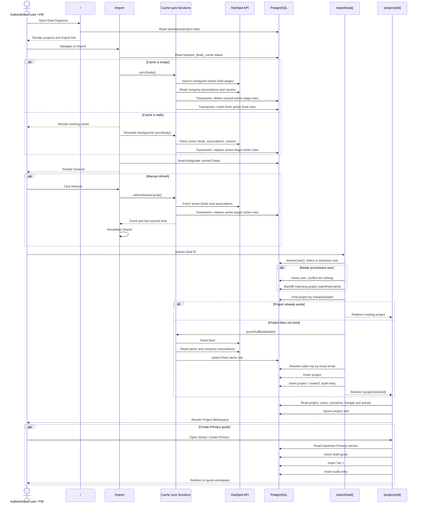

# ARR-001 Evidence Dossier — Project Intake & Workspace

Audit date: 2026-07-29  
Scope: HubSpot Deal → HubSpot Sync → Import → Project Creation → Project Workspace → First PM Actions  
Method: Read-only repository, local Git history, documentation, migrations, and transcript review. No external systems were contacted.

## 1. Executive Workflow

### Code Proven

1. An authenticated Nexus user opens the Deal Organizer at `/`.
2. The user follows the HubSpot import path to `/import`.
3. Nexus reads active-pipeline deals from `hubspot_deals_cache`.
4. If the cache is empty, Nexus performs a synchronous full HubSpot refresh before displaying deals.
5. If it is more than 15 minutes old, Nexus displays existing rows and schedules a background refresh.
6. The user searches or pages through cached deals and submits a HubSpot Deal ID.
7. `importDeal()`:
   - verifies that the user has a local Nexus identity;
   - checks whether the Deal has already been imported;
   - refreshes that individual Deal directly from HubSpot;
   - resolves the HubSpot owner email to a Nexus user when possible;
   - inserts a Nexus project;
   - writes a project `created` audit entry; and
   - redirects to `/projects/{projectId}`.
8. Import does not automatically create a quote.
9. The Project Workspace displays imported Deal context and Nexus-owned project/scenario information.
10. The expected first substantive PM action is to create the Primary quote and proceed to Setup. The user can also refresh HubSpot context, change project category, create scenarios, pin the project, or archive it.

Primary evidence:

- `src/app/page.tsx`
- `src/app/import/page.tsx`
- `src/app/import/deal-list.tsx`
- `src/lib/hubspot-cache.ts`
- `importDeal`, `refreshFromHubspot`, `updateProjectCategory`, and `archiveProject` in `src/app/actions/projects.ts`
- `src/app/projects/[id]/page.tsx`
- `createQuote` and `createScenario` in `src/app/actions/quotes.ts`
- `projects` and `hubspotDealsCache` in `src/db/schema.ts`

### Inferred

- The operational user is expected to be a PM, but the import action does not enforce a PM-specific role.
- The selected HubSpot Deal is expected to belong to one of the configured active pipeline stages.
- The Primary quote is the expected first pricing artifact, based on workspace copy, route selection, and `docs/SPEC.md`.
- HubSpot is intended to remain authoritative for imported Deal context, while Nexus owns workspace state, project classification, scenarios, quotes, and workflow decisions.

### Unknown

Repository evidence does not establish:

- whether the current HubSpot property configuration matches the production portal;
- whether all users admitted through Clerk should be allowed to import, refresh, categorize, and archive projects;
- whether HubSpot owner email is a sufficiently reliable production identity mapping;
- whether business users accept the current `/import` page instead of the import-modal design described in later UX documents;
- whether the active-stage configuration matches the sales organization’s current process;
- whether an audit-entry failure is considered grounds to reject an otherwise successful import;
- production approval, business-process sign-off, support ownership, or rollback procedures.

## 2. Repository Map

### HubSpot Integration

- `src/lib/hubspot.ts`
  - authenticated read client;
  - stage configuration and labels;
  - Deal search/read operations;
  - company associations;
  - owner resolution.
- `src/lib/hubspot-cache.ts`
  - full and single-Deal synchronization;
  - staleness calculation;
  - local cache reads;
  - HubSpot-to-cache mapping.
- `src/lib/hubspot-error.ts`
  - HubSpot-facing error classification.
- `src/app/import/actions.ts`
  - manual full-cache refresh.
- `src/app/api/import/cache-status/route.ts`
  - cache status polling.
- `docs/HUBSPOT_CACHE.md`
  - intended cache ownership and refresh model.

### Cache

- `hubspotDealsCache` in `src/db/schema.ts`
- `src/lib/hubspot-cache.ts`
- `drizzle/0007_amazing_zuras.sql`
  - original Deal cache.
- `drizzle/0044_slice_12_step_8c2_hubspot_deals_cache_ext.sql`
  - additional HubSpot Deal properties.

### Import

- `src/app/import/page.tsx`
- `src/app/import/deal-list.tsx`
- `src/app/import/refresh-header.tsx`
- `src/app/import/actions.ts`
- `src/app/api/import/cache-status/route.ts`
- `importDeal` in `src/app/actions/projects.ts`

### Server Actions

- `src/app/actions/projects.ts`
  - import;
  - HubSpot refresh;
  - category update;
  - archive.
- `src/app/actions/quotes.ts`
  - Primary quote creation;
  - canonical scenario creation;
  - copy/drop/rename and related quote actions.
- `src/app/actions/workspace.ts`
  - project pinning and workspace visitation state.

### Project Routes

- `src/app/projects/[id]/layout.tsx`
- `src/app/projects/[id]/page.tsx`
- `src/app/projects/[id]/quotes/[quoteId]/...`
- `src/lib/nav/...`

### Project Workspace

- `src/app/projects/[id]/page.tsx`
- `src/components/deal-organizer/project-list.tsx`
- `src/lib/workspace-queries.ts`
- project/scenario components under `src/components`
- quote workflow routes under `src/app/projects/[id]/quotes`

### Database Schema

- `projects`, `hubspotDealsCache`, `users`, `quotes`, tiers, cost inputs, activities, attachments, `auditLog`, `userPinnedProjects`, `userProjectVisits`, and `userSurfaceVisits` in `src/db/schema.ts`

### Migrations

- `drizzle/0000_glorious_gateway.sql`
  - users, projects, initial audit structures, unique HubSpot Deal constraint.
- `drizzle/0007_amazing_zuras.sql`
  - HubSpot cache.
- `drizzle/0019_ri_1_workspace_scenarios_audit_bulkraw.sql`
  - workspace/scenario/audit expansion.
- `drizzle/0044_slice_12_step_8c2_hubspot_deals_cache_ext.sql`
  - extended Deal cache fields.

### Audit

- `auditLog` in `src/db/schema.ts`
- audit writes in `src/app/actions/projects.ts`
- audit writes in `src/app/actions/quotes.ts`
- `scripts/verify/audit-log.ts`

### Authentication and Authorization

- `src/middleware.ts`
  - Clerk protection;
  - domain/allow-list admission.
- `src/lib/auth.ts`
  - `ensureUser`;
  - local user provisioning;
  - owner linkage/backfill.
- user role definition in `src/db/schema.ts`

### Tests and Verification

- `scripts/verify/ri-1-schema-readiness.ts`
- `scripts/verify/audit-log.ts`
- other verification scripts under `scripts/verify`
- `docs/redesign-implementation-slice-brief.md`
- navigation and browser QA documents under `docs`
- canonical scenario smoke-test documentation under `docs`

No dedicated Playwright, Jest, or Vitest intake-workflow suite was located.

## 3. Sequence Diagram



### Mutation Inventory

The intake-to-first-action path can mutate:

1. `hubspot_deals_cache` during empty, stale, manual, or single-Deal synchronization.
2. `users` during first authenticated use.
3. Existing projects’ `sales_rep_user_id` during new-user owner backfill.
4. `projects` during import.
5. `audit_log` after project creation.
6. `user_project_visits` when entering a project.
7. `user_pinned_projects` if the user pins the project.
8. `projects` during refresh, category change, or archive.
9. `quotes`, initial tier records, and audit records during Primary creation.
10. Scenario, tier, lineage, attachment, and audit tables during later workspace actions.

## 4. Data Ownership Matrix

### HubSpot Deal and Cache Fields

| Field | Source | Cache destination | Project destination | Import only? | Refreshable? | Editable? | Source of truth |
|---|---|---|---|---|---|---|---|
| Deal ID | HubSpot | `deal_id` | `hubspot_deal_id` | Identity established at import | Cache yes; project identity no | No | HubSpot identity; Nexus link |
| Deal name | HubSpot | `deal_name` | `deal_name` | No | Yes | No | HubSpot |
| Deal stage | HubSpot | `deal_stage` | `deal_stage` | No | Yes | No | HubSpot; project is snapshot |
| Amount | HubSpot | `amount` | Not copied | N/A | Cache | No | HubSpot |
| Close date | HubSpot | `close_date` | Not copied | N/A | Cache | No | HubSpot |
| Owner ID | HubSpot | `sales_rep_id` | `hubspot_owner_id` | No | Yes | No | HubSpot |
| Owner name | HubSpot | `sales_rep_name` | Not copied | N/A | Cache | No | HubSpot |
| Owner email | HubSpot | `sales_rep_email` | Resolves `sales_rep_user_id` | No | Yes | No | HubSpot mapping input |
| Nexus sales-rep user | Nexus users + owner email | N/A | `sales_rep_user_id` | No | Re-resolved | No direct surface found | Nexus-derived linkage |
| PM ID/name/email | Optional HubSpot property | `pm_id`, `pm_name`, `pm_email` | Not imported; PM starts null | Cache-only | Cache | No assignment surface found | HubSpot cache; Nexus unset |
| Company ID | HubSpot association | `associated_company_id` | Not copied | N/A | Cache | No | HubSpot |
| Company name | HubSpot association | `associated_company_name` | `client_name` | No | Yes | No | HubSpot; project is snapshot |
| HubSpot created time | HubSpot | `created_at_hubspot` | Not copied | N/A | Cache | No | HubSpot |
| HubSpot modified time | HubSpot | `updated_at_hubspot` | Not copied | N/A | Cache | No | HubSpot |
| Deal folder / Monday link | HubSpot property | `deal_folder_url` | Not copied | N/A | Full sync; single-upsert defect | No | HubSpot |
| Project service | HubSpot property | `project_service_s` | Not copied | N/A | Full sync; single-upsert defect | No | HubSpot |
| HubSpot project category | HubSpot property | Cache extension | Not imported to Nexus category | N/A | Full sync; single-upsert defect | No | HubSpot |
| Project source / sourcing location | HubSpot property | Cache extension | Not copied | N/A | Full sync; single-upsert defect | No | HubSpot |
| Business segment ID/label | HubSpot property | Cache extension | Not copied | N/A | Full sync; single-upsert defect | No | HubSpot |
| Client PO | HubSpot property | Cache extension | Not copied | N/A | Full sync; single-upsert defect | No | HubSpot |
| Estimated invoice date | HubSpot property | Cache extension | Not copied | N/A | Full sync; single-upsert defect | No | HubSpot |
| Production ship date | HubSpot property | Cache extension | Not copied | N/A | Full sync; single-upsert defect | No | HubSpot |
| Priority | HubSpot property | Cache extension | Not copied | N/A | Full sync; single-upsert defect | No | HubSpot |
| Deal type | HubSpot property | Cache extension | Not copied | N/A | Full sync; single-upsert defect | No | HubSpot |

Full synchronization replaces complete cache rows. `syncDealById()` does not update the later extension columns when resolving an existing-cache conflict.

### Nexus-Owned Project Fields

| Field | Initial value | Refresh behavior | Editable? | Source of truth |
|---|---|---|---|---|
| Project ID | Generated UUID | Never refreshed | No | Nexus |
| PM user | `null` | Not refreshed from cached PM property | No assignment surface found | Nexus, currently unset |
| Nexus project category | `packaging` | Not overwritten | Yes | Nexus |
| Project status | `active` | Not overwritten | Archive supported | Nexus |
| Imported by | Current user | Immutable in reviewed actions | No | Nexus |
| Imported at | Database timestamp | Immutable | No | Nexus |
| Last HubSpot refresh | Import/refresh time | Updated on refresh | No | Nexus |
| Created/updated timestamps | Database/application | Updated by actions | No | Nexus |

## 5. Workspace Reconstruction

### Immediately After Import

The Project Workspace can display:

- client/company name;
- Deal name;
- Deal stage;
- linked sales representative, if email resolution succeeded;
- PM, only if `projects.pm_user_id` is populated through another path;
- last HubSpot synchronization age;
- import time and importing user;
- HubSpot Deal ID;
- Nexus project category;
- project status;
- scenario cards, lineage, activity, and attachment counts when present.

### Code-Proven PM Actions

An authenticated, admitted user can:

- open the HubSpot Deal externally;
- refresh selected project fields from HubSpot;
- edit Nexus project category;
- archive the project;
- pin or unpin it;
- create a Primary draft quote;
- open Setup, Costs, or Pricing through state-aware routing;
- create a scenario;
- identify a recommended scenario;
- copy, rename, or drop eligible scenarios;
- add scenario intent/customer target information;
- navigate scenario versions and workflow surfaces;
- use attachment functionality exposed by the quote/scenario UI.

### Implemented but Not Necessarily Production-Ready

- Project import and duplicate redirection.
- Background and manual cache synchronization.
- User provisioning and owner-email linkage.
- Project refresh.
- Primary quote creation.
- Canonical scenario creation.
- Workspace visit and pin tracking.
- Project/scenario audit entries.

These have code implementations. That does not establish current external verification, business-process parity, operational readiness, or production approval.

### Placeholders or Incomplete Surfaces

- Home “+ New project” is disabled and marked as coming soon.
- “What’s my move” is placeholder behavior.
- No direct Nexus-only project creation path is implemented through the Home control.
- The project page contains stale snapshot/PDF placeholder copy.
- No project PM-assignment control was found.
- Import is a route rather than the modal described in redesign documentation.
- The cached HubSpot category-like property does not initialize Nexus `projectCategory`; Nexus defaults it to `packaging`.

## 6. Control Analysis

### Duplicate Prevention

Code proven:

- `projects.hubspot_deal_id` has a unique database constraint.
- `importDeal()` checks for an existing project and redirects to it.

Limitation:

- The check and insertion are separate.
- Simultaneous imports can both pass the check; one can receive a unique-constraint failure rather than converging on the other request’s project.

### Race Conditions

Observed exposures:

- project import pre-check versus insert;
- Primary version creation using `max(version) + 1`;
- separate quote, initial-tier, and audit inserts;
- separate project update and audit writes;
- separate project creation and audit writes.

`createScenario()` is stronger because related scenario mutations and audit operations are transactionally grouped.

### Authorization

Code proven:

- middleware requires a Clerk session;
- access is restricted by company domain or an allow-list;
- `ensureUser()` provisions or loads a Nexus user.

Not code proven:

- PM-only import;
- role-specific permission for refresh, category update, archive, pinning, or Primary creation;
- project-level membership or visibility restrictions.

Reviewed project actions call `ensureUser()` but do not enforce the stored Nexus role. A pre-existing `read_only` user admitted by middleware therefore appears able to invoke write actions.

### Audit Logging

Implemented for project creation, HubSpot refresh, category changes, archive, and quote/scenario operations.

Limitations:

- project mutations and audit insertion are generally not one transaction;
- audit failure can occur after the business row commits;
- project visits are best-effort, not audit events;
- cache synchronization has no business audit trail.

### Stale Cache

- Staleness threshold is 15 minutes.
- Empty cache causes blocking synchronization.
- Stale cache is served while a background refresh is scheduled.
- Manual refresh and UI polling exist.
- A user can therefore see and select stale Deal information.
- Background-refresh failure is primarily logged to the server console.
- No durable sync-failure record or operator alert was found.

### Sync Failures

- Full refresh retrieves HubSpot data before its database replacement transaction, so a network failure during retrieval does not partially erase the active cache.
- Database replacement is transactional.
- Single-Deal 404 is converted into a controlled not-found result.
- Other HubSpot errors are propagated.
- Background failures do not block the page.

Defect:

- `syncDealById()` inserts all extension fields but omits them from `onConflictDoUpdate.set`.
- Importing or refreshing an existing cache row can update core fields while leaving later-added properties stale until a full synchronization.

### Validation

Implemented:

- non-empty Deal ID;
- project-category allow-list;
- fresh HubSpot read during import rather than trusting displayed form fields;
- structured scenario validation.

Limitations:

- no business validation proves that the Deal remains active at the instant of import;
- no role validation guards project mutations;
- owner-to-user resolution depends on exact email matching;
- database constraints provide much of the final enforcement.

### Transactions

| Operation | Transactional? | Current behavior |
|---|---:|---|
| Full cache replacement | Yes | Fetch precedes atomic delete/insert replacement |
| Single-Deal cache upsert | One statement | Atomic row upsert; conflict update incomplete |
| Project creation + audit | No | Partial success possible |
| Project refresh + audit | No | Project can update without matching audit |
| Category/archive + audit | No | Partial audit failure possible |
| Primary quote + Tier 1 + audit | No | Partial quote construction possible |
| Canonical scenario creation | Yes | Related scenario work is grouped |

## 7. Testing

### Automated Evidence

Found:

- schema-readiness verification scripts;
- audit-log verification;
- build/type/lint-oriented scripts;
- database verification scripts for selected slices.

Not found:

- a dedicated test for `importDeal()`;
- a duplicate-import concurrency test;
- a project-creation/audit-failure test;
- a stale-cache background-failure test;
- a test covering all extension fields in `syncDealById()`;
- role-based write-denial tests;
- a complete Deal-to-Workspace integration test;
- Playwright coverage for intake;
- committed CI evidence that these checks run on every change.

### Historical Technical Verification

Local Git history contains:

- `827ee68` — Slice 2 HubSpot Deal search/import UI.
- `0ba61db` — Slice 3 project import/detail skeleton.
- `93933f6` — Slice 5.6 HubSpot cache and refresh work.
- `82729ca` — workspace redesign and schema-readiness work.
- `db34d0c` — Slice 12 HubSpot Deal-property expansion.

Commit messages and verification documents are historical evidence. They do not prove that current HEAD, a deployed database, or production configuration still passes those checks.

### QA and Manual Verification

Documentation includes navigation audits, workspace redesign briefs, canonical scenario smoke instructions, historical browser observations, and manual verification claims.

The workspace redesign history reports successful schema and development checks but records manual smoke verification as pending at the handoff boundary. No complete current browser-QA result was found for ARR-001.

### Missing Evidence

- Current HubSpot sandbox or production-like verification.
- Live active-stage and property compatibility.
- Clerk role/admission matrix verification.
- Concurrency and fault-injection results.
- Business-user acceptance.
- Operational monitoring and support drill.
- Production approval artifact.

## 8. Findings Table

Legend:

- **Yes** — supported by evidence.
- **Partial** — some evidence; material limitations remain.
- **No evidence** — not established.
- **Unknown** — requires external or human evidence.

| Capability | Implemented | Technically Verified | Business Parity Verified | Operationally Ready | Production Approved | Assessment |
|---|---:|---:|---:|---:|---:|---|
| Cached active-Deal listing | Yes | Partial | Unknown | Partial | Unknown | Code and historical verification; live compatibility unverified |
| Empty-cache synchronization | Yes | Partial | Unknown | Partial | Unknown | Blocking first-load behavior exists |
| Stale-while-refresh behavior | Yes | Partial | Unknown | No evidence | Unknown | Failure is not durably surfaced |
| Manual cache refresh | Yes | Partial | Unknown | Partial | Unknown | UI and action exist |
| Deal search and pagination | Yes | Partial | Unknown | Partial | Unknown | Cache-backed, 50-row pages |
| Direct Deal refresh on import | Yes | Partial | Unknown | Partial | Unknown | Core fields update; extension conflict update is defective |
| Duplicate-project prevention | Yes | Partial | Likely | Partial | Unknown | Constraint exists; concurrent UX is not convergent |
| Project creation | Yes | Partial | Partial | Partial | Unknown | Matches FR-1 broadly; creation/audit not atomic |
| No quote on import | Yes | Yes by inspection | Yes against `SPEC.md` | Partial | Unknown | Explicit behavior |
| Owner-to-user mapping | Yes | Partial | Unknown | Partial | Unknown | Exact email dependency |
| PM assignment from HubSpot | No | N/A | Unknown | No | Unknown | PM cached; project PM set null |
| Project refresh | Yes | Partial | Unknown | Partial | Unknown | Selected snapshot fields only |
| Project category editing | Yes | Partial | Unknown | Partial | Unknown | Nexus-owned enum |
| Project archive | Yes | Partial | Unknown | Partial | Unknown | Role enforcement absent |
| Project visit/pin tracking | Yes | Partial | Unknown | Partial | Unknown | Visit writes are best-effort |
| Primary quote creation | Yes | Partial | Partial | No evidence | Unknown | Non-transactional multi-step mutation |
| Canonical scenario creation | Yes | Partial | Partial | Partial | Unknown | Transactionally stronger |
| Role-based write restrictions | No | No | Unknown | No | Unknown | Stored roles not enforced in reviewed actions |
| Intake audit trail | Yes | Partial | Unknown | Partial | Unknown | Non-atomic with business mutation |
| Intake browser regression suite | No | No | No | No | Unknown | No dedicated Playwright suite |
| Production monitoring | Unknown | Unknown | N/A | Unknown | Unknown | Insufficient evidence |
| Business-process approval | N/A | N/A | Unknown | N/A | Unknown | Requires human artifact |

## 9. Risk Register

| Severity | Evidence | Failure scenario | Business impact | Required before production? |
|---|---|---|---|---:|
| High | Stored roles are not enforced in reviewed project actions | Intended read-only user mutates projects | Unauthorized business-state change | Yes |
| High | Project creation and audit are separate | Project inserts but audit fails | Unexplained project and unreliable compliance history | Yes |
| High | Primary quote, tier, and audit are separate; version uses `max + 1` | Partial quote or concurrent collision | PM workspace failure and manual repair | Yes |
| High | `syncDealById()` omits extension conflict updates | Refresh reports success while business fields stay stale | Downstream processing uses stale context | Yes if fields feed production |
| Medium–High | Duplicate pre-check and insert are separate | Concurrent import produces an error | Confusing intake and support incident | Preferably |
| Medium–High | Stale cache is served; failure is console-only | Users select obsolete Deal data | Incorrect project context | Yes for operational readiness |
| Medium–High | Owner mapping uses exact email | HubSpot and Nexus identities differ | Sales rep remains unlinked | Business decision required |
| Medium | HubSpot PM data is cached but ignored | Expected PM assignment never appears | Ownership gap | If required |
| Medium | HubSpot and Nexus have category-like values | Users assume one controls the other | Misclassification/reporting errors | Business definition required |
| Medium | No intake-specific automated browser/integration suite | Regression reaches release | Intake outage or corrupted workspace entry | Yes |
| Medium | No active-stage revalidation rule is evident | Recently closed Deal is imported | Ineligible active Nexus project | Depends on process |
| Medium | Any admitted user can call project actions | Non-PM changes state | Workflow and audit concern | Yes |
| Medium | Project visit errors are swallowed | Recency ordering is inaccurate | Productivity degradation | No |
| Low–Medium | Documentation describes different import UX | Review follows stale expectations | Acceptance and training confusion | Before approval |
| Unknown | Monitoring, rollback, and support evidence absent | Degradation persists unnoticed | Operational interruption | Yes, evidence required |

## 10. Business Questions

Only questions that cannot be resolved from repository evidence:

1. Which roles may import, refresh, categorize, archive, and create the first quote?
2. Must a Deal remain in an active stage at import time?
3. Is HubSpot owner email the approved identity-matching key?
4. Should the HubSpot PM property populate `projects.pm_user_id`?
5. Which system owns “project category”?
6. Must HubSpot extension fields be current before PM work begins or only before Sales Order submission?
7. Is stale-cache use acceptable during failed refresh, and at what threshold should intake block?
8. Should failure to write an audit event invalidate the business mutation?
9. Is the `/import` route accepted, or is an import modal required?
10. Who has completed business-process parity testing?
11. What constitutes formal production approval, and who grants it?
12. What is the support/reconciliation procedure for partial projects or quotes?

## Top 5 Production Risks

1. Role data exists, but intake and first-action mutations do not enforce it.
2. Project creation and Primary quote construction can partially commit.
3. Single-Deal refresh can leave later HubSpot fields stale while reporting success.
4. Intake lacks an automated end-to-end regression suite, including concurrency and failure cases.
5. Operational readiness lacks evidence for monitoring, failure alerting, business parity, and formal production approval.

## Recommended Next Subsystem

The next subsystem to investigate is **ARR-002: Quote Setup, Cost Intake, and Pricing Entry**:

```text
Project Workspace
→ Primary Quote Creation
→ Setup
→ Cost Inputs
→ Tier/Pricing Generation
→ Preview Eligibility
```

This is an evidence-gathering recommendation for review sequencing, not an architecture or implementation recommendation. Slice 13 implementation should remain paused until the Architecture and Production Readiness Review determines which ARR-001 findings require resolution.

## Evidence Limitations

- No external HubSpot, Supabase, NetSuite, Clerk, or production system was contacted.
- Environment variables and configured property names show expected configuration, not production values.
- Existing code demonstrates implementation, not successful deployment.
- Historical commits, transcripts, QA notes, and scripts demonstrate past work, not current production approval.
- No current business sign-off artifact was found.
- No complete intake-specific automated suite was found.
- No concurrency, fault-injection, or production-like load evidence was found.
- Migrations show intended schema evolution but do not prove any deployed database state.

