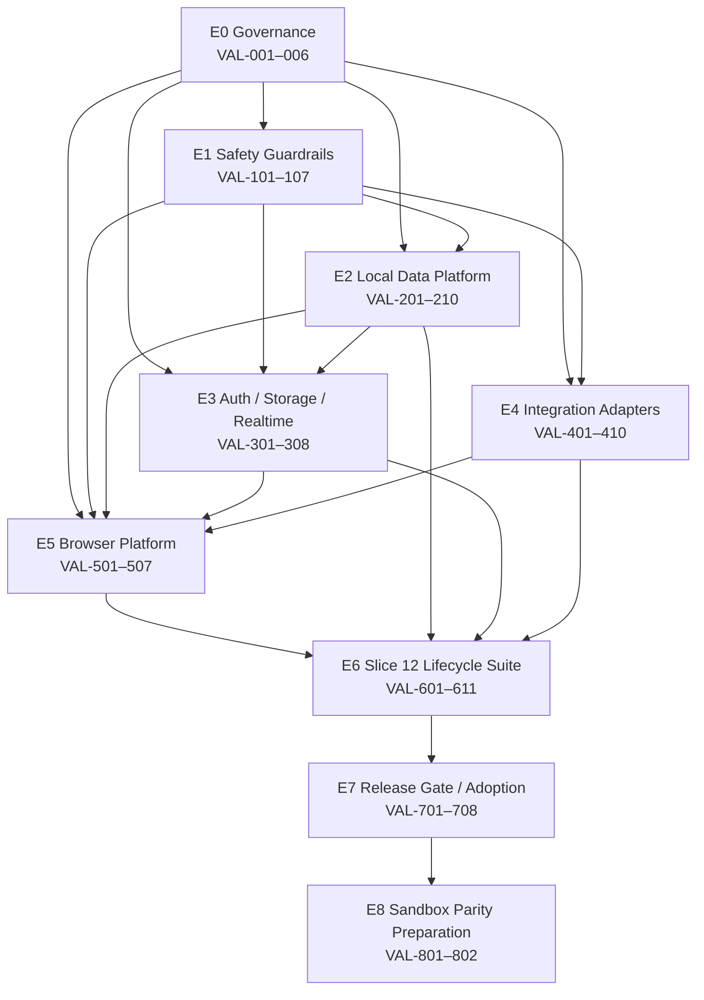

# Validation Infrastructure Backlog

## Executive Summary

This backlog converts the approved [Slice 12 Isolated Validation Readiness Plan](../validation/Slice-12-Isolated-Validation-Readiness-Plan.md) into discrete, dependency-ordered engineering work.

The recommended delivery model is:

1. **Validation Infrastructure Sprint** — build the reusable safety, local database, authentication, storage, integration-adapter, and browser-runner foundations.
2. **Slice 12 Closeout** — implement and execute the Quote Umbrella adversarial lifecycle suite against an exact release-candidate commit.
3. **Slice 13 Adoption** — make the harness a maintained regression gate and reuse it for new administrative/reconciliation workflows.
4. **Production Readiness Review** — optionally perform a separately authorized sandbox parity walkthrough after the isolated suite passes.

The isolated harness must keep the real Nexus UI, server actions, database transactions, audit records, quote state machine, PDF rendering, idempotency logic, and freeze behavior. Only Clerk, Supabase Storage/Realtime, HubSpot, and NetSuite boundaries may be substituted.

### Backlog summary

| Category | Count |
|---|---:|
| Epics | 8 |
| Total tracked work items | 69 |
| P0 work items | 47 |
| P1 work items | 15 |
| P2 work items | 7 |
| Later sandbox-parity items | 2 |

Reusable versus Slice 12-specific ownership is identified on every work-item row. Mixed items deliberately preserve both labels where a reusable capability is first exercised through a Slice 12 fixture or assertion.

### Effort model

| Size | Planning range | Typical shape |
|---|---|---|
| S | Up to 1 engineering day | Decision, guard, narrow script, documentation |
| M | 1–2 engineering days | One bounded seam, fixture, or test capability |
| L | 3–5 engineering days | Cross-module adapter or adversarial workflow suite |

Sizes are comparative estimates, not commitments. Work involving production security boundaries requires review time in addition to implementation time.

### Estimated aggregate effort

| Scope | Estimated effort |
|---|---|
| Minimum harness through first executable lifecycle | 10–16 engineering days |
| Full Slice 12 adversarial matrix and evidence gate | Additional 6–10 engineering days |
| Reusable CI/adoption hardening | Additional 3–6 engineering days |
| Optional authorized sandbox parity preparation | Additional 2–4 engineering days |

The minimum harness is larger than an ordinary test setup because Nexus currently couples browser use to remote PostgreSQL, Clerk, Supabase Storage, HubSpot, and NetSuite.

## Epics

## Epic E0 — Governance and Validation Contract

**Purpose:** Resolve the human decisions that determine the target, security boundary, and accepted fidelity before code is changed.

**Primary milestone:** Validation Infrastructure Sprint — Gate 0  
**Classification:** Reusable governance with one Slice 12 target decision  
**Exit dependency:** All implementation epics depend on this epic.

### Outcomes

- Exact release-candidate commit identified
- Validation-mode contract approved
- Auth, artifact storage, fake-state, and browser-runner decisions recorded
- Clear distinction between isolated technical validation and external business parity

## Epic E1 — Isolation and Data-Safety Guardrails

**Purpose:** Make accidental remote or production access fail closed before any application route or reset operation can run.

**Primary milestone:** Validation Infrastructure Sprint  
**Classification:** Reusable infrastructure  
**Exit dependency:** Required before any local fixture or browser execution.

### Outcomes

- Validation startup rejects remote database hosts
- Real external secrets are forbidden
- Production/Vercel refuses validation mode
- Non-loopback outbound traffic fails the run
- Reset/cleanup cannot target unknown data

## Epic E2 — Disposable Local Data Platform

**Purpose:** Provide a clean PostgreSQL database that can reproduce the current Nexus schema and deterministic fixture state.

**Primary milestone:** Validation Infrastructure Sprint  
**Classification:** Mostly reusable; the initial fixture content is Slice 12-specific  
**Exit dependency:** Required by auth, application startup, adapters, and browser tests.

### Outcomes

- Local PostgreSQL container
- Fresh-schema migration proof
- Explicit Supabase-only migration exclusions
- Safe reset/drop behavior
- Deterministic machine-readable fixture output

## Epic E3 — Local Auth, Artifact Storage, and Realtime Isolation

**Purpose:** Remove unavoidable Clerk and Supabase dependencies while preserving Nexus authorization and Send ordering.

**Primary milestone:** Validation Infrastructure Sprint  
**Classification:** Reusable infrastructure  
**Exit dependency:** Required before the application can execute Send without external access.

### Outcomes

- Validation-only local identity
- Production-safe authentication refusal
- Local PDF artifact persistence
- Realtime external calls disabled or localized

## Epic E4 — Integration Adapter Boundaries and Deterministic Fakes

**Purpose:** Preserve real lifecycle orchestration while substituting only HubSpot and NetSuite operations.

**Primary milestone:** Validation Infrastructure Sprint  
**Classification:** Reusable infrastructure with Slice 12 fake scenarios  
**Exit dependency:** Required for Accept, Rollback, Sales Order Pending, and Sales Order Complete.

### Outcomes

- HubSpot lifecycle interface plus real and fake implementations
- NetSuite lifecycle interface plus real and fake implementations
- Deterministic call logs
- Programmable success, failure, timeout, and retry outcomes
- Production implementation remains default

## Epic E5 — Browser Automation and Evidence Platform

**Purpose:** Add the executable browser runner, telemetry capture, and evidence packaging required by Pattern 71.

**Primary milestone:** Validation Infrastructure Sprint  
**Classification:** Reusable infrastructure  
**Exit dependency:** Required before Slice 12 adversarial specs can run.

### Outcomes

- Explicit Playwright dependency
- Local web-server orchestration
- Console, React warning, failed-request, trace, screenshot, and optional video capture
- Repeatable run metadata

## Epic E6 — Slice 12 Adversarial Lifecycle Coverage

**Purpose:** Execute the complete Quote Umbrella lifecycle and attack navigation, concurrency, duplicate actions, rollbacks, revision, failures, and invalid transitions.

**Primary milestone:** Slice 12 Closeout  
**Classification:** Slice 12-specific, with reusable test patterns  
**Exit dependency:** Depends on E1–E5.

### Outcomes

- Full draft → complete browser walk
- Revision and rollback paths
- Failure and retry paths
- Multi-tab and duplicate-action attacks
- Database and audit invariants
- Completed Sales Order receipt reachability proof

## Epic E7 — Release Gate, Runbook, and Future Adoption

**Purpose:** Turn a one-time harness into an auditable release gate and hand it forward to Slice 13.

**Primary milestone:** Slice 12 Closeout, then Slice 13 Adoption  
**Classification:** Mixed reusable and Slice 12-specific  
**Exit dependency:** Depends on an executed E6 suite.

### Outcomes

- Exact commands and operational runbook
- Final Pattern 71 report generated from executed evidence
- Gate classifications recorded
- Regression ownership assigned for Slice 13

## Epic E8 — Authorized Sandbox Parity Preparation

**Purpose:** Define, but do not execute, the later real HubSpot/NetSuite/Supabase parity walkthrough.

**Primary milestone:** Production Readiness Review  
**Classification:** Integration/operations-specific  
**Exit dependency:** Only after the isolated gate passes and explicit authorization exists.

### Outcomes

- Authorization checklist
- Cross-system reconciliation and cleanup protocol
- Exact evidence requirements

## Work Breakdown Structure

### E0 — Governance and Validation Contract

| ID | Work item | Size | Priority | Dependencies | Reuse | Recommended owner |
|---|---|---|---|---|---|---|
| VAL-001 | Pin the exact release-candidate branch and commit SHA; define when a rerun is mandatory | S | P0 | None | Slice 12-specific decision; reusable SHA-recording convention | Slice 12 Closeout |
| VAL-002 | Approve validation-only auth approach: in-app provider seam versus local reverse proxy | S | P0 | None | Reusable | Architecture/Infrastructure Sprint |
| VAL-003 | Approve local PDF artifact behavior and evidence-retention policy | S | P0 | None | Reusable | Architecture/Infrastructure Sprint |
| VAL-004 | Approve NetSuite fake-state location: process-local, local service, or database-backed | S | P0 | None | Reusable | Architecture/Infrastructure Sprint |
| VAL-005 | Approve Playwright as the browser runner and lockfile dependency | S | P0 | None | Reusable | Infrastructure Sprint |
| VAL-006 | Record validation claims taxonomy: implemented, technically verified, business-parity verified, operationally ready, production approved | S | P1 | VAL-001 | Reusable | Architecture Review |

### E1 — Isolation and Data-Safety Guardrails

| ID | Work item | Size | Priority | Dependencies | Reuse | Recommended owner |
|---|---|---|---|---|---|---|
| VAL-101 | Define an isolated validation environment contract and required variable set | S | P0 | VAL-002–VAL-005 | Reusable | Infrastructure Sprint |
| VAL-102 | Implement startup assertion for loopback/local-container database host and validation database name | M | P0 | VAL-101 | Reusable | Infrastructure Sprint |
| VAL-103 | Reject isolated mode when HubSpot, NetSuite, Clerk secret, or Supabase service-role credentials are present | M | P0 | VAL-101 | Reusable | Infrastructure Sprint |
| VAL-104 | Reject isolated mode under production deployment indicators, including `VERCEL_ENV=production` | S | P0 | VAL-101 | Reusable | Infrastructure Sprint |
| VAL-105 | Add a non-loopback outbound-network deny for the validation process and browser context | M | P0 | VAL-101, VAL-501 | Reusable | Infrastructure Sprint |
| VAL-106 | Add negative safety tests proving every startup guard fails closed | M | P0 | VAL-102–VAL-105 | Reusable | Infrastructure Sprint |
| VAL-107 | Add secret-redaction checks for traces, screenshots, logs, and generated reports | S | P1 | VAL-501, VAL-503 | Reusable | Infrastructure Sprint |

### E2 — Disposable Local Data Platform

| ID | Work item | Size | Priority | Dependencies | Reuse | Recommended owner |
|---|---|---|---|---|---|---|
| VAL-201 | Define local PostgreSQL container/version with `pg_trgm` support and ephemeral volume | M | P0 | VAL-101 | Reusable | Infrastructure Sprint |
| VAL-202 | Prove canonical Drizzle migrations apply from empty local database | M | P0 | VAL-201 | Reusable | Infrastructure Sprint |
| VAL-203 | Inventory and explicitly exclude Supabase-only publication/storage manual migrations | S | P0 | VAL-202 | Reusable | Infrastructure Sprint |
| VAL-204 | Add schema readiness and migration-head assertion | S | P1 | VAL-202, VAL-203 | Reusable | Infrastructure Sprint |
| VAL-205 | Add guarded database reset/drop command with loopback and database-name verification | M | P0 | VAL-102, VAL-201 | Reusable | Infrastructure Sprint |
| VAL-206 | Extract reusable local fixture-building primitives from the Step 10 provisioner | M | P0 | VAL-202 | Mixed | Infrastructure Sprint |
| VAL-207 | Build a true draft Slice 12 lifecycle fixture with deterministic fake external identifiers | M | P0 | VAL-206, VAL-401, VAL-404 | Slice 12-specific | Slice 12 Closeout |
| VAL-208 | Add optional pre-seeded sent, accepted, pending, failed, and complete visual-state fixtures | M | P2 | VAL-206, VAL-207 | Mostly Slice 12-specific; pattern reusable | Slice 13 Adoption |
| VAL-209 | Emit machine-readable fixture handoff containing IDs, routes, expected totals, and run ID | S | P1 | VAL-207 | Reusable pattern | Infrastructure Sprint |
| VAL-210 | Add fixture invariants: above-floor margin, active settings, valid mappings, resolvable items, and no real IDs | M | P0 | VAL-207 | Mixed | Slice 12 Closeout |

### E3 — Local Auth, Artifact Storage, and Realtime Isolation

| ID | Work item | Size | Priority | Dependencies | Reuse | Recommended owner |
|---|---|---|---|---|---|---|
| VAL-301 | Introduce request-identity interface used consistently by middleware and `ensureUser()` | M | P0 | VAL-002, VAL-101 | Reusable | Infrastructure Sprint |
| VAL-302 | Implement deterministic isolated identity and seed matching `users` row | M | P0 | VAL-202, VAL-301 | Reusable | Infrastructure Sprint |
| VAL-303 | Add production-negative tests proving isolated identity is unreachable outside isolated mode | M | P0 | VAL-104, VAL-301, VAL-302 | Reusable | Infrastructure Sprint |
| VAL-304 | Introduce quote-PDF artifact interface while preserving render-before-transaction ordering | M | P0 | VAL-003 | Reusable | Infrastructure Sprint |
| VAL-305 | Implement run-scoped local filesystem PDF store and loopback read URL | M | P0 | VAL-304, VAL-501 | Reusable | Infrastructure Sprint |
| VAL-306 | Verify resend creates unique artifacts and superseded-version links remain readable | M | P1 | VAL-305, VAL-207 | Mixed | Slice 12 Closeout |
| VAL-307 | Disable or localize Supabase Realtime under isolated mode | S | P1 | VAL-101 | Reusable | Infrastructure Sprint |
| VAL-308 | Document Realtime parity as outside the isolated technical gate | S | P2 | VAL-307 | Reusable | Slice 13 Adoption |

### E4 — Integration Adapter Boundaries and Deterministic Fakes

| ID | Work item | Size | Priority | Dependencies | Reuse | Recommended owner |
|---|---|---|---|---|---|---|
| VAL-401 | Define HubSpot lifecycle interface covering owner lookup, stage read/label, stage+amount update, rollback, and amount-only update | M | P0 | VAL-101 | Reusable | Infrastructure Sprint |
| VAL-402 | Route current HubSpot production implementation through the interface without changing behavior | M | P0 | VAL-401 | Reusable | Infrastructure Sprint |
| VAL-403 | Implement deterministic fake HubSpot state, call log, and programmable failure outcomes | M | P0 | VAL-401, VAL-105 | Reusable | Infrastructure Sprint |
| VAL-404 | Define NetSuite lifecycle interface covering item/source/segment resolution, item groups, SO create, and `tranId` fetch | M | P0 | VAL-004, VAL-101 | Reusable | Infrastructure Sprint |
| VAL-405 | Route current NetSuite production implementation through the interface without changing payload, idempotency, or persistence behavior | L | P0 | VAL-404 | Reusable | Infrastructure Sprint |
| VAL-406 | Implement deterministic fake NetSuite outcomes for found/not-found/ambiguous items and item-group cache/external/create paths | M | P1 | VAL-404, VAL-105 | Reusable | Infrastructure Sprint |
| VAL-407 | Implement fake Sales Order success, timeout, rejection, missing `tranId`, and retry convergence | M | P0 | VAL-404, VAL-406 | Reusable | Infrastructure Sprint |
| VAL-408 | Add adapter contract tests comparing fake and real return/error shapes | M | P1 | VAL-402, VAL-403, VAL-405–VAL-407 | Reusable | Infrastructure Sprint |
| VAL-409 | Add deterministic adapter-call ledger accessible to test assertions without production exposure | M | P1 | VAL-403, VAL-407 | Reusable | Infrastructure Sprint |
| VAL-410 | Add production-mode tests proving fake adapters cannot be selected | M | P0 | VAL-103, VAL-402, VAL-405 | Reusable | Infrastructure Sprint |

### E5 — Browser Automation and Evidence Platform

| ID | Work item | Size | Priority | Dependencies | Reuse | Recommended owner |
|---|---|---|---|---|---|---|
| VAL-501 | Add and pin `@playwright/test`; install the approved browser runtime | M | P0 | VAL-005 | Reusable | Infrastructure Sprint |
| VAL-502 | Configure local database/application lifecycle through Playwright web-server/global setup | M | P0 | VAL-201–VAL-205, VAL-301–VAL-305, VAL-501 | Reusable | Infrastructure Sprint |
| VAL-503 | Capture console errors, React warnings, failed requests, traces, screenshots, and run metadata | M | P0 | VAL-501, VAL-502 | Reusable | Infrastructure Sprint |
| VAL-504 | Add loopback-only browser request policy and fail on unexpected outbound traffic | M | P0 | VAL-105, VAL-501 | Reusable | Infrastructure Sprint |
| VAL-505 | Add deterministic serial-project configuration for stateful lifecycle tests | S | P1 | VAL-502 | Reusable | Infrastructure Sprint |
| VAL-506 | Add evidence-directory naming and retention conventions keyed by commit/run ID | S | P2 | VAL-001, VAL-503 | Reusable | Slice 13 Adoption |
| VAL-507 | Add a smoke test proving local startup, auth, fixture route, and teardown on a clean database | M | P0 | VAL-207, VAL-302, VAL-305, VAL-403, VAL-407, VAL-502 | Reusable gate | Infrastructure Sprint |

### E6 — Slice 12 Adversarial Lifecycle Coverage

| ID | Work item | Size | Priority | Dependencies | Reuse | Recommended owner |
|---|---|---|---|---|---|---|
| VAL-601 | Implement primary Draft Preview → Send → Client Review browser path | L | P0 | VAL-207, VAL-306, VAL-403, VAL-502–VAL-505 | Slice 12-specific | Slice 12 Closeout |
| VAL-602 | Implement sent revision → draft → re-send assertions, including snapshot and artifact history | M | P0 | VAL-601 | Slice 12-specific | Slice 12 Closeout |
| VAL-603 | Implement Accept, Rollback, re-accept, and revise-from-accepted paths | L | P0 | VAL-403, VAL-601, VAL-602 | Slice 12-specific | Slice 12 Closeout |
| VAL-604 | Implement Sales Order Pending → failed → retry → Complete path | L | P0 | VAL-407, VAL-409, VAL-603 | Slice 12-specific | Slice 12 Closeout |
| VAL-605 | Assert completed receipt internal ID, `tranId`, push ledger, direct `?tab=tier` reachability, and freeze state | M | P0 | VAL-604 | Slice 12-specific | Slice 12 Closeout |
| VAL-606 | Attack deep links, refresh, hard refresh, Back/Forward, and invalid/unreachable tabs at each state | M | P0 | VAL-601–VAL-605 | Pattern reusable; cases Slice 12-specific | Slice 12 Closeout |
| VAL-607 | Attack duplicate clicks, repeated actions, stale tabs, and concurrent browser pages | L | P0 | VAL-601–VAL-605 | Pattern reusable; cases Slice 12-specific | Slice 12 Closeout |
| VAL-608 | Inject HubSpot failure, NetSuite timeout/rejection, missing `tranId`, and post-complete amount-patch failure | L | P1 | VAL-403, VAL-407, VAL-601–VAL-605 | Pattern reusable; scenarios Slice 12-specific | Slice 12 Closeout |
| VAL-609 | Assert database state, audit rows, review events, snapshots, push ledger, and absence of duplicate orders after each mutation | L | P0 | VAL-204, VAL-409, VAL-601–VAL-608 | Pattern reusable; assertions Slice 12-specific | Slice 12 Closeout |
| VAL-610 | Add focused regression for AdvanceBar visibility during irreversible modals | S | P1 | VAL-601, VAL-603, VAL-604 | Slice 12-specific | Slice 12 Closeout |
| VAL-611 | Add visual-state matrix using optional seeded pending/failed/complete fixtures | M | P2 | VAL-208, VAL-503, VAL-605 | Slice 12-specific | Slice 13 Adoption |

### E7 — Release Gate, Runbook, and Future Adoption

| ID | Work item | Size | Priority | Dependencies | Reuse | Recommended owner |
|---|---|---|---|---|---|---|
| VAL-701 | Document one-command bootstrap, run, inspect, and teardown workflow | M | P0 | VAL-507, VAL-601–VAL-609 | Reusable | Infrastructure Sprint |
| VAL-702 | Verify teardown removes local database volume, PDF artifacts, and transient mock state | M | P0 | VAL-205, VAL-305, VAL-409, VAL-701 | Reusable | Infrastructure Sprint |
| VAL-703 | Execute final suite against exact release-candidate SHA and archive evidence | M | P0 | VAL-001, VAL-601–VAL-610, VAL-702 | Slice 12-specific | Slice 12 Closeout |
| VAL-704 | Update `Browser-Validation-Slice-12-Final.md` solely from executed evidence | M | P0 | VAL-703 | Slice 12-specific | Slice 12 Closeout |
| VAL-705 | Add maintained CI job after local harness stabilizes | M | P1 | VAL-703 | Reusable | Slice 13 Adoption |
| VAL-706 | Define test ownership, flaky-test policy, artifact retention, and mandatory rerun triggers | S | P1 | VAL-703, VAL-705 | Reusable | Slice 13 Adoption |
| VAL-707 | Add a harness extension checklist to Slice 13 feature briefs | S | P2 | VAL-706 | Reusable | Slice 13 |
| VAL-708 | Review whether the stale acceptance-field behavior is an expected forensic rule or a defect before adding Slice 13 readers | S | P1 | VAL-603, VAL-609 | Slice 13-specific policy | Slice 13 |

### E8 — Authorized Sandbox Parity Preparation

| ID | Work item | Size | Priority | Dependencies | Reuse | Recommended owner |
|---|---|---|---|---|---|---|
| VAL-801 | Define explicit authorization, target deployment, credential, customer/item, and change-window checklist | S | P2 | VAL-704 | Operationally reusable | Production Readiness Review |
| VAL-802 | Define cross-system before/after reconciliation and cleanup evidence for Nexus, HubSpot, NetSuite, and Supabase Storage | M | P2 | VAL-801 | Operationally reusable | Production Readiness Review |

No E8 task authorizes or performs a sandbox walkthrough.

## Dependency Graph



### Critical path

```text
VAL-001–005
  → VAL-101–106
  → VAL-201–205
  → VAL-301–305
  → VAL-401–407
  → VAL-501–507
  → VAL-207/210
  → VAL-601–605
  → VAL-606/607/609
  → VAL-701–704
```

### Parallelizable work

After E0 decisions:

- E1 safety contract and E2 database research can proceed in parallel.
- HubSpot and NetSuite adapter work can proceed in parallel after the validation-mode contract.
- Playwright base configuration can begin while adapter work proceeds, but full startup cannot complete until E2–E4 are usable.
- Local PDF storage and local auth can proceed independently after their decisions.
- Navigation attacks and failure-injection specs can be developed in parallel after the primary lifecycle path is stable.

## Priority

### P0 — Required to unblock Slice 12 browser release gate

P0 includes:

- target commit decision;
- validation security boundary;
- local database and migrations;
- safe reset;
- local auth;
- local PDF storage;
- HubSpot and NetSuite adapter seams;
- fake success/failure paths needed by the lifecycle;
- Playwright and evidence capture;
- full lifecycle, navigation, concurrency, and database/audit assertions;
- teardown;
- final executed report.

No Slice 12 PASS should be issued until all P0 items through VAL-704 are complete.

### P1 — Required for a maintainable and trustworthy harness

P1 includes:

- claims taxonomy;
- schema-head assertion;
- fixture handoff;
- resend artifact history;
- Realtime isolation documentation;
- adapter contract/call-log tests;
- failure-injection breadth;
- AdvanceBar regression;
- CI adoption;
- ownership/flaky-test policy;
- Slice 13 acceptance-field decision.

P1 items may be split between the Infrastructure Sprint and Slice 13 Adoption, but security and contract-integrity P1s should not be deferred past the first production-readiness review.

### P2 — Useful extensions after the primary gate works

P2 includes:

- pre-seeded visual-state fixtures;
- evidence-retention conventions;
- visual-state matrix;
- Slice 13 brief checklist;
- authorized sandbox parity preparation.

P2 work must not delay the first isolated lifecycle execution unless it reveals a P0 safety issue.

## Estimated Effort

### By epic

| Epic | Small tasks | Medium tasks | Large tasks | Estimated range |
|---|---:|---:|---:|---|
| E0 Governance | 6 | 0 | 0 | 2–4 days including decisions/review |
| E1 Safety | 3 | 4 | 0 | 5–8 days |
| E2 Data platform | 3 | 7 | 0 | 8–13 days |
| E3 Auth/storage | 2 | 6 | 0 | 7–12 days |
| E4 Adapters | 0 | 9 | 1 | 12–20 days |
| E5 Browser platform | 2 | 5 | 0 | 6–10 days |
| E6 Slice 12 suite | 1 | 4 | 6 | 22–38 days |
| E7 Gate/adoption | 3 | 5 | 0 | 6–11 days |
| E8 Sandbox preparation | 1 | 1 | 0 | 2–3 days |

These epic totals assume one person performs every task independently. They intentionally overstate calendar time relative to a focused implementation because:

- tasks can be combined into one pull request;
- several tasks are review/checklist slices of the same code change;
- E6 scenarios share fixtures and page objects;
- multiple epics can proceed concurrently.

### Recommended delivery slices

| Delivery slice | Included work | Team effort estimate |
|---|---|---|
| Infrastructure MVP | E0 P0s, E1 P0s, VAL-201–207, VAL-210, VAL-301–305, VAL-307, VAL-401–407, VAL-410, VAL-501–507 | 10–16 engineering days |
| Slice 12 executable happy path | VAL-601–605, core VAL-609 | 4–7 engineering days |
| Pattern 71 adversarial completion | VAL-606–610, expanded VAL-609, VAL-701–704 | 4–7 engineering days |
| Slice 13 adoption/hardening | P1/P2 remainder, CI and seeded visual variants | 3–6 engineering days |

With two engineers working on independent infrastructure and integration/browser tracks, the first complete isolated run is plausibly a 1.5–2.5 week calendar effort, subject to fresh-database migration findings.

## Risks

| Risk | Severity | Related backlog | Mitigation / stop condition |
|---|---|---|---|
| Validation startup can reach a remote database | P0 | VAL-102, VAL-106 | Block all execution until negative tests pass |
| Real integration secrets leak into isolated mode | P0 | VAL-103, VAL-107 | Fail startup and redact artifacts |
| Local auth is usable in production | P0 | VAL-104, VAL-301–303 | Production refusal plus negative tests |
| Reset command can destroy non-validation data | P0 | VAL-205 | Loopback and database-name guard before any destructive action |
| Fake adapter bypasses real orchestration | P1 | VAL-401–410 | Mock only external operations; retain real actions and transactions |
| Adapter refactor changes production behavior | P1 | VAL-402, VAL-405, VAL-408 | Contract tests and focused review before browser work |
| Plain PostgreSQL cannot reproduce migration head | P1 | VAL-202–204 | Treat as infrastructure blocker; document Supabase-only differences |
| PDF local adapter changes Send ordering | P1 | VAL-304–306 | Assert render/store succeeds before quote status changes |
| In-memory fake state diverges across workers | P1 | VAL-004, VAL-409 | Use one loopback service or persisted run-scoped state |
| Realtime disablement hides multi-user behavior | P2 | VAL-307–308, VAL-607 | Test stale tabs and refresh; separate Realtime parity scope |
| Fixture starts in the wrong lifecycle state | P1 | VAL-207 | Require true draft primary fixture |
| Test passes a branch that is not the release candidate | P1 | VAL-001, VAL-703 | Record SHA and rerun after target changes |
| Browser evidence contains credentials or customer data | P0 | VAL-103, VAL-107 | Validation-only data and automated artifact scan |
| Multi-tab tests create nondeterministic false failures | P2 | VAL-505, VAL-607 | Serial suite, explicit barriers, deterministic fake delays |
| Mocks drift from HubSpot/NetSuite contracts | P1 | VAL-408, VAL-801–802 | Contract-shape tests and later authorized parity review |
| Harness becomes a permanent hidden production branch | P1 | VAL-410, VAL-706 | Production refusal, documented ownership, routine negative tests |

## Recommended Implementation Order

### Stage 0 — Decisions

1. VAL-001 through VAL-005
2. VAL-006

Do not begin validation-mode implementation until the security-sensitive choices are explicit.

### Stage 1 — Safety before capability

1. VAL-101
2. VAL-102 through VAL-105
3. VAL-106

No fixture, local auth, or fake integration should run before these guards exist.

### Stage 2 — Local database

1. VAL-201
2. VAL-202 and VAL-203
3. VAL-204 and VAL-205
4. VAL-206

Fresh-schema migration failure is an early stop condition because every later task depends on reliable local state.

### Stage 3 — Local application prerequisites

Run in parallel:

- Auth: VAL-301 → VAL-302 → VAL-303
- PDF storage: VAL-304 → VAL-305
- Realtime: VAL-307

Then create the draft fixture:

- VAL-207
- VAL-209
- VAL-210

### Stage 4 — Integration seams

Run HubSpot and NetSuite tracks in parallel:

- HubSpot: VAL-401 → VAL-402/403
- NetSuite: VAL-404 → VAL-405/406 → VAL-407

Then:

- VAL-408
- VAL-409
- VAL-410

### Stage 5 — Browser platform

1. VAL-501
2. VAL-502
3. VAL-503 through VAL-505
4. VAL-507
5. VAL-107

The infrastructure MVP is complete only when VAL-507 passes on a clean database without any non-loopback request.

### Stage 6 — Slice 12 primary lifecycle

1. VAL-601
2. VAL-602
3. VAL-603
4. VAL-604
5. VAL-605
6. Core VAL-609 assertions alongside every step

### Stage 7 — Adversarial attacks

Run in parallel after the primary lifecycle is stable:

- VAL-606 navigation/deep-link attacks
- VAL-607 duplicate/concurrency attacks
- VAL-608 integration failure injection
- VAL-610 modal/AdvanceBar regression

Complete expanded VAL-609 database/audit invariants after all scenarios exist.

### Stage 8 — Closeout

1. VAL-701
2. VAL-702
3. VAL-703
4. VAL-704

### Stage 9 — Slice 13 adoption

1. VAL-208 and VAL-611
2. VAL-705 and VAL-706
3. VAL-707 and VAL-708
4. VAL-306/308/506 if not already completed

### Stage 10 — Later parity preparation

1. VAL-801
2. VAL-802

Do not execute a sandbox walkthrough without a separate explicit authorization.

## Exit Criteria

## Infrastructure Sprint Exit

- [ ] All E0 P0 decisions are recorded.
- [ ] Validation startup refuses remote database hosts, production mode, and real credentials.
- [ ] Negative guard tests pass.
- [ ] Local PostgreSQL starts from a clean ephemeral volume.
- [ ] Canonical migrations apply from empty database.
- [ ] Supabase-only manual migrations are explicitly excluded.
- [ ] Reset/drop cannot target anything except the recognized local validation database.
- [ ] Local auth reaches the protected Quote route without Clerk.
- [ ] Send can persist and reopen a local PDF while preserving production ordering.
- [ ] HubSpot and NetSuite fakes are selected only in isolated mode.
- [ ] Production adapter paths retain contract tests.
- [ ] Playwright starts and tears down the local stack.
- [ ] No non-loopback network request is observed.
- [ ] VAL-507 passes from a clean workstation state.

## Slice 12 Closeout Exit

- [ ] The exact release-candidate SHA is recorded.
- [ ] A true draft fixture drives Preview → Send → Client Review.
- [ ] Sent revision and re-send pass.
- [ ] Accept, Rollback, re-accept, and revise-from-accepted pass.
- [ ] Sales Order pending, failed, retry, and complete paths pass.
- [ ] Duplicate actions and multiple-tab stale actions do not create duplicate transitions or fake orders.
- [ ] Deep links, refresh, hard refresh, and Back/Forward remain lifecycle-consistent.
- [ ] Completed `?tab=tier` receipt displays internal ID and `tranId`.
- [ ] Complete state rejects prohibited mutations.
- [ ] AdvanceBar does not remain actionable over irreversible modals.
- [ ] Database, snapshot, audit, review-feed, and push-ledger invariants pass.
- [ ] No unexpected console errors, React warnings, or failed requests remain.
- [ ] Screenshots and traces are captured and secret-free.
- [ ] Teardown removes all local state.
- [ ] `docs/validation/Browser-Validation-Slice-12-Final.md` is updated only from executed evidence.

## Slice 13 Adoption Exit

- [ ] Harness runs through a maintained command or CI job.
- [ ] Ownership and flaky-test policy are documented.
- [ ] New Slice 13 lifecycle/admin paths identify which existing fixture and adapter scenarios they extend.
- [ ] Stale acceptance-field policy is resolved before administrative readers treat those columns as live truth.
- [ ] Visual-state fixtures cover pending, failed, and complete variants.

## Production Readiness Review Exit

- [ ] Isolated technical gate passes.
- [ ] Business-parity gaps are explicitly listed.
- [ ] Any sandbox walkthrough has separate authorization.
- [ ] Cross-system cleanup and reconciliation steps are approved before execution.
- [ ] A sandbox success is not represented as production deployment or production approval.

## Final Backlog Recommendation

Create a dedicated **Validation Infrastructure Sprint** before substantial Slice 13 implementation. That sprint should own reusable foundations through VAL-507. Keep the Quote Umbrella scenario implementation and final report under **Slice 12 Closeout**. Move CI hardening, pre-seeded visual matrices, and harness-extension governance into **Slice 13 Adoption**.

Slice 13 product work can be planned in parallel, but lifecycle-changing implementation should not rely on Slice 12 being production-approved until VAL-704 is complete.
